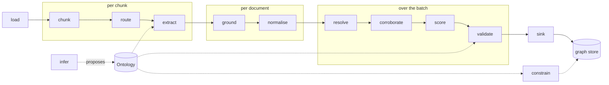

# odke

**Text in, a grounded knowledge graph out.**

odke is the seam between text and any graph store. You bring documents and an
ontology; it hands back a `KnowledgeGraph` of entities, facts and the links
between entities. Every fact carries its receipts: the document, the character
span, the source tier and the grounding verdict that produced it. Where that
graph goes next, whether Neo4j, JSONL or your own store, is a `Sink`, and a sink
is one method.

> The only pipeline that asks a second model whether the cited span supports
> the claim — and lets you measure every stage against your own labelled data.

It is an independent implementation of the architecture in
[ODKE+ (arXiv:2509.04696)](https://arxiv.org/abs/2509.04696), generalised from
one production knowledge graph into an SDK anyone can install. It is not
affiliated with or endorsed by Apple Inc.; see
[NOTICE](https://github.com/deepskandpal/odke/blob/main/NOTICE).

## A superset, not a product

The pipeline is thirteen stages. Each one is a `Protocol` in `openodke.stages`, and
each has a pass-through default: the identity function, or the nearest thing to
one. A caller who wants only extract-and-sink gets no-ops for the other eleven
and never notices them. Every corpus needs a different subset of the thirteen,
and nothing domain-specific enters the code. Labels, ontologies, tenancy keys and
qualifier semantics all arrive as data, through one of these seams
([DECISIONS #20](decisions.md)).



`constrain` and `infer` are not on the `run()` path. The constrainer compiles
the ontology into the store's own constraints for a sink to apply before its
first write. The inferrer is a bootstrap, not a mode: it proposes an ontology
that you review, freeze and then pass in ([DECISIONS #8](decisions.md);
[Ontology inference](inference.md)).

## What is here today

odke is pre-alpha. This site documents what is on `main`:

| Area | Module | Status |
|---|---|---|
| Data model, the thirteen Protocols, the pipeline | `openodke.types`, `openodke.stages`, `openodke.pipeline` | on `main` — [Concepts](concepts.md) |
| Ontology loading, validation and diff | `openodke.ontology`, `odke ontology …` | on `main` — [Ontology](ontology.md) |
| Grounding: span verification and a second model | `openodke.ground` | on `main` — [Grounding](grounding.md) |
| Neo4j sink and constraint bootstrap | `openodke.sinks.neo4j` | on `main` — [Neo4j sink](neo4j.md) |
| Evaluation against your own labels | `openodke.eval`, `odke eval` | on `main` — [Evaluation](evaluation.md) |
| Loaders (text, Markdown, records, HTML, PDF, DOCX), the sentence chunker, pattern / LLM / hybrid extractors | `openodke.loaders`, `openodke.chunking`, `openodke.extract` | on `main` — [Loaders & extraction](loaders-and-extraction.md) |
| Normalise, resolve, corroborate, score | `openodke.corroborate` | on `main` — [Resolution & corroboration](resolution-and-corroboration.md) |
| Ontology import from OWL, RDFS, SKOS and a live Neo4j graph | `Ontology.from_owl`, `Ontology.from_neo4j` | on `main` — [Ontology](ontology.md#importing-a-schema-you-already-have) |
| Ontology inference: a draft to review, then freeze | `openodke.infer`, `odke ontology infer`, `odke ontology freeze` | on `main` — [Ontology inference](inference.md) |
| JSONL, Cypher-file, neo4j-admin CSV, RDF and NetworkX sinks | `openodke.sinks` | on `main` — [Sinks](sinks.md) |
| The whole pipeline from one config file | `openodke.run`, `odke run` | on `main` — [`odke run`](run.md) |
| The ablation: extraction alone, + grounding, + corroboration | `openodke.eval.run_ablation`, `odke eval ablation` | on `main` — [Evaluation](evaluation.md#ablation) |

## Five minutes, no keys

Nothing below needs a model provider, a database or a network. The extractor is
a toy regular expression, to show the seam: `openodke.extract` has the real pattern,
LLM and hybrid extractors, and any class with an `extract(chunk, ontology)`
method is an extractor.

```python
import re

from openodke import Document, Entity, Evidence, Fact, GroundingVerdict, Ontology, Pipeline, Span
from openodke.ground import SpanGrounder

ontology = Ontology.from_dict(
    {
        "name": "people",
        "types": {"Person": {"description": "A human being."}},
        "predicates": {"born": {"domain": ["Person"], "range": "integer"}},
    }
)


class BornIn:
    """'<First> <Last> was born in <year>', cited by character offset."""

    pattern = re.compile(r"(?P<name>[A-Z]\w+ [A-Z]\w+) was born in (?P<year>\d{4})")

    def extract(self, chunk, ontology):
        for m in self.pattern.finditer(chunk.text):
            # Offsets in the chunk plus the chunk's start: offsets in the document.
            span = Span(
                doc_id=chunk.doc_id,
                start=chunk.start + m.start(),
                end=chunk.start + m.end(),
                quote=m[0],
            )
            yield Fact(
                subject=Entity(key=m["name"].lower(), type="Person", label=m["name"]),
                predicate="born",
                object_value=int(m["year"]),
                evidence=(Evidence(doc_id=chunk.doc_id, span=span),),
                extractor="born-in-regex",
            )


doc = Document(id="d1", text="Ada Lovelace was born in 1815. Charles Babbage was born in 1791.")
kg = Pipeline(ontology, BornIn(), grounder=SpanGrounder()).run([doc])

print([(f.subject.label, f.object_value) for f in kg.facts])
# [('Ada Lovelace', 1815), ('Charles Babbage', 1791)]
print(kg.stats)
# {'documents': 1, 'chunks': 1, 'skipped': 0, 'deferred': 0, 'refused': 0}

assert all(f.evidence[0].span.resolve(doc) == f.evidence[0].span.quote for f in kg.facts)
assert all(f.verdict is GroundingVerdict.UNCHECKED for f in kg.facts)
```

Every stage that was not named ran as its pass-through: one chunk per document,
every chunk routed to extraction, keys taken as given, every fact its own claim,
everything accepted. `SpanGrounder` checked that each cited offset really says
what the fact claims it says. It found them, so it left the verdict `UNCHECKED`
for a model to decide. The free check never says `SUPPORTED` by itself; see
[Grounding](grounding.md).

## Where next

- [Installation](installation.md): the base install talks to nothing; extras add
  drivers and providers.
- [Concepts](concepts.md): `Fact`, its signature, the two clocks, links, chunks
  and the thirteen Protocols.
- [`odke run`](run.md): the whole pipeline from one config file, and a walk through
  the end-to-end example.
- [Decisions](decisions.md): the design calls and what each one cost.
