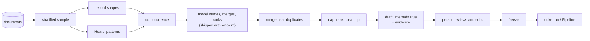

# Ontology inference

For a corpus that arrives with no schema, `openodke.infer` drafts one: a small
ontology, marked `inferred=True`, with the evidence behind every type and
predicate, for a person to review, edit and freeze before anything is extracted
against it.

!!! warning "A bootstrap, not a mode"
    Nothing runs inference on its own. `Pipeline` does not take an inferrer, and
    `odke run` refuses one ([DECISIONS #8](decisions.md)). A schema that silently
    re-infers between runs produces a graph whose edge labels change underneath
    existing queries; the one-time cost of a review buys a graph that stays
    queryable. So the flow is: infer once, review, edit, freeze, then run guided by
    the frozen file.



The design behind it is that **a model should name and rank a schema, not discover
one.** Deterministic proposers find the candidates first, each citing the
characters it saw them in; a model, when one is used, may only rename, merge and
rank what they found, or propose something a passage it was shown actually states.

## From the shell

```bash
odke ontology infer corpus/ --out draft.yaml --no-llm   # free: no model, no key, no cost
odke ontology infer corpus/ --out draft.yaml            # the infer model names what they found
odke ontology validate draft.yaml                        # warns: unreviewed
# ...review and edit draft.yaml...
odke ontology freeze draft.yaml --by "Ada Lovelace"      # refuses while validate finds an error
```

`infer` reads every path with the directory loader and takes `--max-types` (10),
`--max-predicates` (25), `--sample-words` (8000), `--seed` (0), `--name`, `--model`
for the `infer` role, and `--no-llm`. It writes the draft (`.yaml`, `.yml` or
`.json`; YAML needs the `yaml` extra), the full evidence beside it as
`<stem>.evidence.json`, and prints every proposal with what backs it. A provider
error exits 1 with a reminder that `--no-llm` runs the deterministic proposers
alone.

## The sample

Inferring from everything is slow and no better than inferring from a good sample.
`sample_corpus(docs, words=8000, seed=0)` takes one that is:

- **Stratified.** Documents are grouped by modality and length band, then by
  source (the file a record came from), then by document, and every level takes
  turns. A 10,000-row CSV gets one turn per round next to a three-paragraph note,
  and a book-length document gives up one chunk per visit.
- **Reproducible.** Every shuffle is seeded and keyed on what a document is (its
  file name, row and text), never on the random `Document.id`. The same files and
  the same seed give the same sample on any machine, in any directory, so a draft
  can be regenerated and diffed.
- **Recorded.** `SampleRecord` lists every chunk taken, by source, offsets and word
  count, in the order it was taken, and `strata` counts chunks per stratum.

8,000 words is some forty short records and a dozen pages of prose: enough for each
stratum to show its repeated shapes a few times, because schema signals repeat.

## The deterministic proposers

Three proposers run in order, each seeing what the ones before it found. Their
patterns are regular expressions and a stopword list, and they are conservative on
purpose: a wrong proposal costs a reviewer a minute, and a noisy one costs every
reviewer that minute.

| Proposer | Reads | Proposes |
|---|---|---|
| `RecordShapeProposer` (`records`) | structured documents | A record set is a type named from its file (`people.csv` → `Person`). Each column is a predicate whose range is read off its values: all dates `date`, all integers `integer`. A column whose values are another record set's names is an edge to that type; a column of capitalised names that recur is an edge to a type named after the column. A column that names every row once is the type's key. |
| `HearstProposer` (`hearst`) | prose | Hearst's patterns: "languages such as Python and Rust", "cars, trucks and other vehicles", "vehicles including cars", "A mathematician is a scientist", "Ada Lovelace was a mathematician". A proper name is an instance of the class; a common noun is a subclass, with the class as its parent. |
| `CooccurrenceProposer` (`cooccurrence`) | prose | Two known instances in one clause, a few words apart, with only lower-case words between them: "Ada Lovelace *works at* Acme Corp" → `works_at: Person → Company`. |

Every candidate carries the spans that produced it, checked against the document
like every other span in the package, and its **support** is the number of distinct
documents behind those spans.

```python
import tempfile
from pathlib import Path

from openodke.infer import infer_ontology
from openodke.infer.review import summary
from openodke.loaders import DirectoryLoader

corpus = Path(tempfile.mkdtemp())
(corpus / "people.csv").write_text(
    "name,born,employer,city\n"
    "Ada Lovelace,1815-12-10,Acme Corp,London\n"
    "Grace Hopper,1906-12-09,Globex,Paris\n"
    "Alan Turing,1912-06-23,Acme Corp,London\n"
    "Linus Torvalds,1969-12-28,Globex,Paris\n",
    encoding="utf-8",
)
(corpus / "companies.csv").write_text("name\nAcme Corp\nGlobex\n", encoding="utf-8")
(corpus / "notes.md").write_text(
    "# Notes\n\nAda Lovelace works at Acme Corp. Grace Hopper works at Globex.\n\n"
    "A mathematician is a scientist. They used languages such as Python and Rust.\n",
    encoding="utf-8",
)
documents = list(DirectoryLoader().load(corpus))

draft = infer_ontology(documents, llm=False)
print(summary(draft))
# types (6)
#   City  [support 4 · records · "Paris" (people.csv line 5)]
#   Person  [support 4 · records · "Linus Torvalds" (people.csv line 5)]
#   Company  [support 2 · records · "Globex" (companies.csv line 3)]
#   Language  [support 1 · hearst · "languages such as Python and Rust" (notes.md @115)]
#   Mathematician is a Scientist  [support 1 · hearst · "mathematician is a scientist" (notes.md @75)]
#   Scientist  [support 1 · hearst · "mathematician is a scientist" (notes.md @75)]
# predicates (4)
#   name: Person, Company -> string, single  [support 6 · records · "Globex" (companies.csv line 3)]
#   employer: Person -> Company, single  aka works_at  [support 5 · cooccurrence, records · "Globex" (people.csv line 5)]
#   born: Person -> date, single  [support 4 · records · "1969-12-28" (people.csv line 5)]
#   city: Person -> City, single  [support 4 · records · "Paris" (people.csv line 5)]
# merges (2)
#   merged predicate name → name: name ~ name: same name
#   merged predicate employer, works_at → employer: employer ~ works_at: 2 shared (subject, value) pairs
```

`employer` came from a CSV column and `works_at` from two sentences. Their names
share nothing, but they were observed on the same people and the same companies,
so they merged, and `works_at` survives as an alias that extraction still matches.

## What the model may do, and may not

With `llm=True` (the default in Python; drop `--no-llm` in the shell),
`LLMProposer` makes **one call through the `infer` role**. It is shown the
candidates, each with its support and the proposer that found it, and a
stratified prefix of the sample (about 3,000 words), and asked for a small
ontology back as structured output.

- **It may rename, merge and rank.** An entry lists the candidates it covers in
  `from`; it takes their evidence and keeps their names as aliases. Its ordering
  breaks ties after support.
- **It may propose something new only with a quote**, words of a passage it was
  shown, which is checked the way an extractor's quote is: found in the passage, or
  discarded ([DECISIONS #3](decisions.md)).
- **Anything uncited is rejected.** An entry that claims no candidate and quotes no
  passage has no evidence, and the rejection is recorded, as is a `from` naming no
  candidate and a quote that is not in the passages.
- **It may not delete.** What comes back is added to the proposals, not
  substituted for them: a candidate the model leaves out is kept as found, for the
  reviewer. The merge step still refuses a merge whose ranges conflict.
- A reply that is not the contract gets one repair attempt and is then recorded
  and ignored; a provider error raises. No vendor is named: the client comes from
  `client=`, `spec=`, `roles=` or `openodke.llm.resolve`.

```python
from openodke.llm import ScriptedClient

reply = {
    "types": [
        {"name": "Person", "from": ["Person"]},
        {"name": "Organisation", "description": "A company.", "from": ["Company"]},
        {"name": "Planet"},
    ],
    "predicates": [
        {"name": "birth_date", "domain": ["Person"], "range": "date", "from": ["born"]},
        {"name": "orbits", "domain": ["Planet"], "range": "Planet", "quote": "orbits the sun"},
    ],
}
named = infer_ontology(documents, client=ScriptedClient([reply]))

assert "Organisation" in named.ontology.types and "Company" not in named.ontology.types
assert named.ontology.predicates["birth_date"].aliases == ("born",)
for rejection in named.rejections:
    print(rejection.kind, rejection.name, "|", rejection.reason)
# type Planet | no evidence: claims no candidate and quotes no passage
# predicate orbits | quote not in the passages
assert "City" in named.ontology.types  # left out by the model, kept for the reviewer
```

## Merging near-duplicates

The failure that makes naive inference useless is `works_at`, `employer`,
`employed_by` and `worksFor` all in one schema, and a graph nobody can query.
`merge()` clusters candidates, keeps one name, and makes every other spelling an
alias. Two candidates are linked by, strongest first:

1. **the same name**, once case, separators, plural and tense are forgotten;
2. **a claim**: one lists the other among its aliases, which is how the model says
   "these are the ones I named";
3. **similar names**, by `difflib` ratio (0.9 for types, 0.85 for predicates);
4. **shared evidence**, for predicates: at least two of the same (subject, value)
   pairs, and at least half of the smaller side's.

A link is refused, with the reason recorded, when merging would change what the data
means: the **ranges conflict** (`date` against `string`; `integer` with `number`
widens instead), the **domains do not overlap** (for any link but the same name), or
**one type is a kind of the other** (`Car` never merges into `Vehicle`). The name a
cluster keeps is the model's, then the best supported, then the shortest.

## Building the draft

- **The cap.** The best-supported `max_types` types (10) and `max_predicates`
  predicates (25) are kept, because small ontologies are what work and a large one
  degrades extraction. A predicate whose domain or range did not make the cut goes
  with it.
- **`min_support`** (1) drops a candidate backed by fewer documents.
- **`importance`** is support on a log scale, relative to the best-supported
  predicate kept, so snippets have something to rank by without one predicate
  backed by every row of a large table flattening the rest.
- **Consistency.** Aliases that would name two entries, keys that name no kept
  predicate, and parents that were not kept are removed, so the draft passes
  `validate()` without an error. Every removal is recorded in `dropped`.

`infer_ontology` returns an `Inference`: the `ontology`, the `sample` record, the
`evidence` behind every entry (keyed `types.X` and `predicates.y`, spans addressed
by source file, line and offsets rather than by the random ids of one load), the
merge `decisions`, what was `dropped`, the model's `rejections`, its `calls` and
cost, and the `settings` it ran with. `Ontology.infer(...)` takes the same
arguments and returns the ontology alone, and `OntologyInferrer` is the same
bootstrap as an `Inferrer` stage whose `last` attribute holds the full `Inference`.

```python
ontology = draft.ontology
assert ontology.inferred
assert [d.code for d in ontology.validate()] == ["unreviewed"]  # a warning, not an error
evidence = draft.evidence["predicates.employer"]
assert (evidence.support, evidence.proposers, evidence.aliases) == (
    5,
    ("cooccurrence", "records"),
    ("works_at",),
)
assert draft.sample.strata == {"structured/short": 6, "unstructured/short": 1}
```

## The review file

The review is the step that makes inference safe, so the file is built for it. A
YAML draft opens with a header saying the schema is inferred and what to do about
it, and every type and predicate carries its evidence as comments directly above
it: its support, the proposers that found it, and its first quotes with where they
came from. They are comments, so the file still loads as an ontology, and the
evidence disappears the moment a reviewer deletes the entry it backs. Entries leave
out the fields at their defaults.

```yaml
# INFERRED ONTOLOGY — review it before anything is extracted against it.
#
# Proposed from a corpus by openodke; no person has checked it yet (DECISIONS #8).
# Each entry's evidence is in the comments above it. Edit or delete what is
# wrong, run `odke ontology validate` on this file, then `odke ontology freeze`.
#
# sample: 69 words, 7 chunks from 7 of 7 documents, seed 0
# model: none — deterministic proposers only
# evidence: draft.evidence.json
name: inferred
inferred: true
types:
  # support: 4 documents, found by records
  #   "Paris" — people.csv line 5
  #   "Paris" — people.csv line 3
  #   "London" — people.csv line 2
  City: {}
  # support: 4 documents, found by records
  #   "Linus Torvalds" — people.csv line 5
  #   "Grace Hopper" — people.csv line 3
  #   "Ada Lovelace" — people.csv line 2
  Person:
    keys:
    - name
```

JSON has no comments, so a JSON draft is the bare ontology. Both get
`<stem>.evidence.json` beside them: the whole `Inference` except the ontology, with
every span the comments abbreviate, every merge decision, every drop and every
rejection.

## Freezing

`ontology.freeze(by=...)` is the last step of the bootstrap. It returns a copy with
`inferred` cleared and `frozen_at` and `frozen_by` recorded, and leaves the draft as
it was.

- It **refuses while `validate()` reports an error**, raising
  `OntologyFreezeError` with the diagnostics in `.diagnostics`: freezing is the
  claim that a person has looked and the schema holds. Warnings do not block.
- It **needs a reviewer**: an empty `by` raises `ValueError`, because a review
  nobody did is not a review. `odke ontology freeze` defaults `--by` to the current
  user, prints each error and exits 1 while there are any, and otherwise rewrites
  the file (or `--out`) without the review comments and with a header naming the
  reviewer.
- From then on an edit is a schema change: `odke ontology diff` reports
  `frozen_at` and `frozen_by` like any other field.

```python
from openodke.ontology import OntologyFreezeError

frozen = ontology.freeze(by="Ada Lovelace")
assert (frozen.inferred, frozen.frozen_by, frozen.validate()) == (False, "Ada Lovelace", [])
assert ontology.inferred  # the draft is unchanged

city = ontology.predicates["city"].model_copy(update={"range": "Town"})
broken = ontology.model_copy(update={"predicates": {**ontology.predicates, "city": city}})
try:
    broken.freeze(by="Ada Lovelace")
except OntologyFreezeError as exc:
    print(exc)
# cannot freeze an ontology with 1 validation error; fix it first:
#   error: predicates.city.range: 'Town' is neither an entity type nor a literal type (boolean, date, datetime, float, integer, number, string) [unknown-range]
```

Until it is frozen, an inferred ontology says so wherever it could do lasting harm:

- `validate()` adds an `unreviewed` **warning** at the path `inferred`, so
  `odke ontology validate` prints it without failing.
- `Neo4jSink(..., ontology=draft)` and `Neo4jSink.bootstrap(draft)` warn with
  `UnreviewedOntologyWarning`, because constraints compiled from a schema nobody
  reviewed are hard to take back. It is warned, not refused: experimenting with a
  draft on a scratch database is doing nothing wrong.

```python
import warnings

from openodke.ontology import UnreviewedOntologyWarning
from openodke.sinks.neo4j import Neo4jSink

with warnings.catch_warnings(record=True) as caught:
    warnings.simplefilter("always")
    with Neo4jSink("bolt://localhost:7687", auth=("neo4j", "change-me"), ontology=ontology):
        pass  # creating the sink does not connect
assert UnreviewedOntologyWarning in {w.category for w in caught}
```
