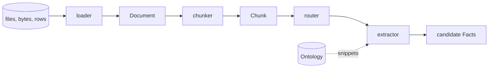

# Loaders & extraction

The front of the pipeline turns files into facts in three steps: a **loader**
reads bytes into `Document`s, a **chunker** cuts each document into `Chunk`s, and
an **extractor** reads each chunk and returns candidate `Fact`s held to the
ontology. One rule runs through all three, and it is the reason the rest of the
pipeline can trust a citation: every `Span` is a pair of character offsets into
`Document.text` that resolves to exactly the text it claims
([DECISIONS #3](decisions.md), [#19](decisions.md)).



Everything on this page is in `openodke.loaders`, `openodke.chunking` and `openodke.extract`,
and runs on the base install except where an extra is named.

## Loaders

Every loader satisfies `openodke.stages.Loader`: `load(source)` takes a path or bytes
and returns documents, each with a `modality` and a `tier` attached. The modality
is what the [hybrid extractor](#hybridextractor) routes on, and the tier is the
[`SourceTier`](concepts.md#spans-evidence-and-trust) every fact from the document
inherits.

| Loader | Reads | One document per | `modality` | `Document.text` is | Extra |
|---|---|---|---|---|---|
| `TextLoader` | plain text | file | `unstructured` | the file, decoded | — |
| `MarkdownLoader` | Markdown | file | `unstructured` (or as set) | the file, decoded | — |
| `CsvLoader`, `TsvLoader` | delimited text with a header | data row | `structured` | the row, rendered | — |
| `JsonLoader` | a JSON array or object | element | `structured` | the record, rendered | — |
| `JsonlLoader` | JSON Lines | non-blank line | `structured` | the record, rendered | — |
| `ParquetLoader` | Parquet | row | `structured` | the row, rendered | `parquet` |
| `RecordsLoader` | mappings already in memory | mapping | `structured` | the record, rendered | — |
| `HtmlLoader` | HTML | file | `semi_structured` if it holds a table or definition list, else `unstructured` | extracted text, Markdown-shaped | — |
| `PdfLoader` | PDF | file, or page | `unstructured` | extracted text | `pdf` |
| `DocxLoader` | Word `.docx` | file | `semi_structured` if it holds a table, else `unstructured` | extracted text, Markdown-shaped | `docx` |
| `DirectoryLoader` | a directory, or one file | whatever the suffix's loader makes | from that loader | from that loader | per file |

Every loader takes `tier=` (default `unverified`). The text-based loaders take
`encoding=`, and `MarkdownLoader`, `HtmlLoader`, `PdfLoader` and `DocxLoader` take
`modality=` to override what they would decide. Parquet, PDF and DOCX import
their library when a file is read, not when the module is imported, so the base
install can name every loader.

### Text and Markdown: the file is the text

A path is read as bytes and decoded, never opened in text mode. Text mode turns
CRLF into LF, and every offset after the first Windows line ending would then
point short of the file the caller has. So a span into a text or Markdown
document is also an offset into the file.

`MarkdownLoader` renders nothing and strips nothing. It records the heading
outline in `metadata["headings"]`, with the offsets of each heading's text, and
takes the first level-one heading as the title. `heading_path(doc, offset)` puts
any offset back under its section.

```python
from openodke.loaders import MarkdownLoader, heading_path

(guide,) = MarkdownLoader().load(b"# Guide\r\n\r\n## Install\r\n\r\nRun pip.\r\n")

assert guide.title == "Guide"
assert guide.text.index("Run pip.") == 25  # CRLF kept: a file offset
assert heading_path(guide, guide.text.index("Run pip.")) == ("Guide", "Install")
print(guide.metadata["headings"][1])
# {'level': 2, 'text': 'Install', 'start': 14, 'end': 21}
```

Markdown that is mostly tables and `Key: value` lines is better loaded with
`modality="semi_structured"`, which sends it to the pattern extractor as well as
to the model.

### Records: one document per row

A row from a CSV or a JSON array has no prose to cite, but a fact from it still
needs evidence a grounder can check. So each record becomes a `structured`
document whose `text` is one `path: value` line per leaf, rendered the same way
every time. The record itself rides in `metadata["row"]`, and the offsets of
every rendered value in `metadata["fields"]`. The pattern extractor reads typed
values from the row and cites the rendered cell; it never parses the rendering
back.

```python
from openodke.loaders import CsvLoader

(ada,) = CsvLoader(tier="curated").load(b"\xef\xbb\xbfname,born\nAda Lovelace,1815-12-10\n")

print(ada.text)
# name: Ada Lovelace
# born: 1815-12-10
print(ada.metadata)
# {'row': {'name': 'Ada Lovelace', 'born': '1815-12-10'}, 'fields': {'name': [6, 18], 'born': [25, 35]}, 'row_index': 0, 'line': 2}
assert (ada.modality, ada.tier.value) == ("structured", "curated")
```

- The record loaders decode with `utf-8-sig` by default. A spreadsheet export
  starts with a byte-order mark, and left in place it silently renames the first
  column. The offsets a record's facts cite are into the rendering, so stripping
  it costs nothing.
- `metadata["line"]` is the physical line a CSV, TSV or JSONL record starts on,
  so a fact can be traced to the file even though its span points into the
  rendering. `odke run` uses it to name documents `people.csv#L2`.
- A CSV with a duplicate column name, or a row with more cells than the header,
  is refused: both would lose a value silently.
- `JsonLoader(records="data.items")` names the array inside a wrapper object.
- Paths are the part of JSONPath records need: `address.city`, `tags[0]`,
  `["key.with.dots"]`, and `tags[*]` in a mapping.
- `record_document(mapping, ...)` is public, so rows from a database cursor or a
  DataFrame become documents that read the same way. `RecordsLoader` does it for
  an iterable of mappings.

### HTML, PDF and Word: extracted text and a source map

What sits on disk in these formats is markup, a content stream or a zip of XML:
nothing a span could point into and nothing a grounder could check a quote
against. So `Document.text` is the *extracted* text, every span indexes that, and
`metadata["source_map"]` records where each piece of it came from. The grounder
never reads the map. A person getting from a fact back to the original file does.

The map is plain JSON, because `Document.metadata` has to be:

```json
{
  "format": "html",
  "units": [{"path": "/html[1]/body[1]/p[1]"}],
  "segments": [[24, 39, 0, 84, 99]]
}
```

A segment `[start, end, unit, source_start, source_end]` says
`doc.text[start:end]` came from `[source_start, source_end)` of `units[unit]`.
Segments are sorted and never overlap. Where the two lengths are equal, the
correspondence is character for character. Where they differ (`&amp;` became
`&`, a run of whitespace became one space), the segment is indivisible, and any
part of it maps to the whole source range. Characters in no segment were written
by the loader rather than read: the blank line between two blocks, the `|` of a
rendered table.

What a unit names depends on the format:

| Format | Unit | Source offsets are into |
|---|---|---|
| HTML | `{"path": "/html[1]/body[1]/div[2]/p[1]"}`: the element, as an XPath over the tags as written | the decoded markup, one coordinate space for the whole file |
| PDF | `{"page": 3}`, one-based, plus `"label"` when the page has a printed label other than its number | that page's `page.extract_text()`; the map records the pypdf version under `"extractor"` |
| DOCX | `{"paragraph": 4}`, or `{"table": 0, "row": 1, "cell": 2, "paragraph": 0}`; a table nested in a cell adds `"inner"` | that paragraph's `text` |

`source_locations(doc, start, end)` does the lookup. It returns one entry per
source unit the range touches, in text order: the unit's locator plus
`start`/`end` (the part of the range it covers) and `source_start`/`source_end`.
For a fact, pass `span.start, span.end`. It raises `ValueError` for a document
with no map (text and Markdown offsets already are file offsets) or for a range
outside the text.

#### HTML

`HtmlLoader` runs on the standard library (`html.parser`). The text is shaped like
Markdown on purpose, because the rest of the pipeline already reads Markdown:

- Paragraphs, headings, lists and tables are separated by a blank line, so the
  chunker sees the page's own paragraphs.
- Headings are written `## Heading` and recorded in `metadata["headings"]` in
  `MarkdownLoader`'s shape, so `heading_path` works unchanged.
- A table becomes a pipe table, or `Key: value` lines when every row is a header
  cell and a data cell (an infobox). A definition list becomes `Term: definition`
  lines. Those are the shapes the pattern extractor reads, so a page holding one
  is `semi_structured`.
- Whitespace collapses the way a browser collapses it, except inside `pre`.
  Entities are decoded. `script`, `style`, `noscript` and `template` are dropped.
  `nav` and `footer` are dropped only with `strip_boilerplate=True`, because a
  footer is sometimes the only place a page says who published it.
- The `<title>` is the title, else the first `h1`. It is not part of the text.

```python
from openodke.loaders import HtmlLoader, source_locations

markup = b"""<html><head><title>Acme</title></head><body>
<h1>Acme &amp; Sons</h1>
<p>Acme was   founded in 1999.</p>
<table><tr><th>Founded</th><td>1999</td></tr><tr><th>HQ</th><td>Leeds</td></tr></table>
</body></html>"""
(page,) = HtmlLoader(tier="authoritative").load(markup)

print(page.text)
# # Acme & Sons
#
# Acme was founded in 1999.
#
# Founded: 1999
# HQ: Leeds
assert (page.title, page.modality) == ("Acme", "semi_structured")

start = page.text.index("founded in 1999")
(where,) = source_locations(page, start, start + len("founded in 1999"))
print(where)
# {'path': '/html[1]/body[1]/p[1]', 'start': 24, 'end': 39, 'source_start': 84, 'source_end': 99}
assert markup.decode()[where["source_start"] : where["source_end"]] == "founded in 1999"
```

On ordinary pages the loader closes what HTML lets authors leave open (`p`, `li`,
`td`, `tr`, `dt`, `dd`), which keeps paths right; on pathological markup a path is
a best effort. The offsets are not a best effort: they come from the parser's own
position in the markup.

#### Word

`DocxLoader` reads body paragraphs and tables in document order.

- Paragraphs are separated by a blank line, and a line break inside a paragraph
  stays a newline.
- A paragraph styled `Heading 1` to `Heading 9` is written `# Heading` (at most
  six marks) and recorded in `metadata["headings"]`.
- A table becomes a pipe table whose first row is the header. A merged cell's text
  appears once, in its first grid slot, so columns still line up.
- The title is the core `title` property, else the first `Title`-styled
  paragraph, else the first level-one heading.
- Headers, footers, footnotes, comments, text boxes and content controls are not
  read, because python-docx does not expose them in document order.

```python
import io

import docx

from openodke.loaders import DocxLoader

word = docx.Document()
word.add_heading("Acme", level=1)
word.add_paragraph("Acme was founded in 1999.")
table = word.add_table(rows=2, cols=2)
for cell, value in zip(table._cells, ["name", "founded", "Acme", "1999"], strict=True):
    cell.text = value
buffer = io.BytesIO()
word.save(buffer)

(memo,) = DocxLoader().load(buffer.getvalue())
print(memo.text)
# # Acme
#
# Acme was founded in 1999.
#
# | name | founded |
# | --- | --- |
# | Acme | 1999 |
cell = memo.text.rindex("1999")
(where,) = source_locations(memo, cell, cell + 4)
assert (where["table"], where["row"], where["cell"], where["paragraph"]) == (0, 1, 1, 0)
```

#### PDF

`PdfLoader` uses pypdf, which is pure Python with no dependencies of its own. A
page number and a character index into that page's text is what a citation
needs, so a heavier library with bounding boxes was not worth its cost.

- One document per file by default, so a sentence running over a page break is
  still one sentence to the chunker. Pages are joined by `page_separator`, a blank
  line by default, which the chunker reads as a paragraph break.
- `per_page=True` makes one document per page instead, with `metadata["page"]`
  and a `#page=N` fragment on the URI, which PDF viewers open at that page.
- No de-hyphenation. Telling `exam-`/`ple` (one word) from `well-`/`known` (two)
  across a line end needs a dictionary, and a wrong join writes a word into
  `text` that is not in the file.
- A scanned page has no text layer and extracts as nothing; OCR is not done. With
  `per_page` it is still a document, with empty text, so it shows up rather than
  vanishing. Multi-column layouts come out in pypdf's reading order.

A PDF's map has one unit per page that had text, and records the extractor
version, because extraction changes between pypdf releases. Its shape, for a
two-page file whose second page is labelled `ii`:

```json
{
  "format": "pdf",
  "extractor": "pypdf <version>",
  "units": [{"page": 1}, {"page": 2, "label": "ii"}],
  "segments": [[0, 61, 0, 0, 61], [63, 120, 1, 0, 57]]
}
```

### Directories

`DirectoryLoader(pattern="**/*")` walks a directory, or takes one file, and hands
each file to the loader its suffix names. Files are visited in sorted order, so
two runs over one directory produce documents in the same order.

| Suffix | Loader |
|---|---|
| `.txt`, `.text` | `TextLoader` |
| `.md`, `.markdown` | `MarkdownLoader` |
| `.html`, `.htm` | `HtmlLoader` |
| `.csv` / `.tsv` | `CsvLoader` / `TsvLoader` |
| `.json` | `JsonLoader` |
| `.jsonl`, `.ndjson` | `JsonlLoader` |
| `.parquet` | `ParquetLoader` (needs `parquet`) |
| `.pdf` | `PdfLoader` (needs `pdf`) |
| `.docx` | `DocxLoader` (needs `docx`) |

- Modality comes from the loader that claims the suffix, so a mixed directory
  routes itself: prose goes to the model, and records never cost a call.
- A file no loader claims is skipped rather than guessed at. Reading an image as
  UTF-8 would produce a document, and every fact from it would be noise.
- A file whose loader needs an extra that is not installed is **skipped with a
  `MissingExtraWarning`** naming the file and the install line, and the walk goes
  on: one PDF should not stop a thousand Markdown files from loading.
  `missing_extras="raise"` raises the `MissingExtraError` instead.
- `loaders={".suffix": loader}` replaces the table. `tier=` and `encoding=` are
  passed to every loader in the default one.

```text
MissingExtraWarning: skipped corpus/scan.pdf: reading PDF needs pypdf. Run: pip install "openodke[pdf]"
```

## Chunking: never split a sentence

`SentenceChunker(max_words=200, *, overlap=0)` packs whole sentences into chunks
of at most `max_words` words. Its one guarantee is the one provenance rests on:
`chunk.text == doc.text[chunk.start:chunk.end]`, always. Nothing is normalised.
Paragraphs and sentences are found by scanning the original string, and a chunk
is a pair of indices into it, so CRLF, tabs and non-ASCII text survive because
they are never touched.

Boundaries are chosen in order of preference: a paragraph break, then a sentence
break, **and never anything smaller**. A router asked "fact or narrative?" about
half a sentence is asked nothing ([DECISIONS #19](decisions.md)). So:

- A sentence longer than the cap becomes a chunk of its own rather than being cut,
  and a document with no punctuation at all is one sentence per paragraph.
- A chunk ends at the last paragraph break inside it, unless that would leave it
  less than half full: a heading stranded as its own chunk is as useless to a
  router as half a sentence.
- "3.14" and "example.com" are not sentence ends, and neither is a period after a
  common abbreviation (`Dr.`, `e.g.`) or a single initial (`J. R. R. Tolkien`). A
  miss merges two sentences, which is the safe direction: it never splits one.
- Chunks start and end on non-whitespace, so the whitespace between two chunks
  belongs to neither.
- `overlap` repeats that many trailing sentences at the start of the next chunk,
  so a fact stated across a boundary is seen whole at least once. The repeated
  facts are merged by signature later.

```python
from openodke import Document, SentenceChunker

doc = Document(
    id="d1",
    text="Dr. Ada Lovelace was born in 1815. She wrote notes.\r\n\r\n"
    "Charles Babbage designed engines. He was born in 1791.",
)
chunks = list(SentenceChunker(max_words=12).chunk(doc))

for chunk in chunks:
    print(chunk.start, chunk.end, chunk.text)
# 0 51 Dr. Ada Lovelace was born in 1815. She wrote notes.
# 55 109 Charles Babbage designed engines. He was born in 1791.
assert all(doc.text[c.start : c.end] == c.text for c in chunks)

run_on = Document(id="d2", text="One sentence with far more than five words in it is never cut.")
assert [c.text for c in SentenceChunker(max_words=5).chunk(run_on)] == [run_on.text]
```

## Extractors

An extractor is anything with `extract(chunk, ontology) -> Iterable[Fact]`. The
three built in share one way of keying entities and citing spans, so a fact from
a table and a fact from prose are the same shape and merge by signature:

- **Keys.** `entity_key(type, name)` is the type plus the name with case, spacing
  and surrounding punctuation folded: `Person:ada lovelace`. It is deliberately
  naive. Deciding that "A. Lovelace" is "Ada Lovelace" is the
  [resolver's](resolution-and-corroboration.md#resolve) job, where a `Resolution`
  records the decision. The type is in the key, so Paris the person and Paris the
  city stay two nodes.
- **Edges.** A predicate whose range is an entity type makes an edge to an entity
  keyed exactly as a subject of that name would be.
- **Identity keys.** Every fact is stamped with `ontology.identity_keys(predicate)`,
  so identity-bearing qualifiers enter its signature
  ([DECISIONS #15](decisions.md)).
- **Spans.** A span is checked with `Span.is_faithful` against the chunk and then
  against the document, which also catches a chunker whose text drifted from the
  document it claims to slice. The evidence carries the document's URI, tier and
  `retrieved_at` when the extractor has the document.
- **Documents.** `Chunk` holds only offsets and text, so an extractor that needs a
  document's modality, tier or row looks it up in its `documents` mapping. Pass
  the documents you pass to `Pipeline.run`; `odke run` does this for you.

### `PatternExtractor`

Facts from structure alone: exact, free, deterministic, with
`extractor="pattern"` and zero model calls. It reads three shapes.

- **Records.** A `structured` document's row. With no `mappings`, field names are
  matched against predicate names, labels and aliases, case- and
  punctuation-blind, and the entity type is the one the matched predicates most
  plausibly describe. The subject is named by the type's `keys`.
- **Pipe tables.** Header cells are matched to predicates, and each body row is
  one entity, named by the column holding a key predicate or else the first
  column.
- **`Key: value` blocks.** Consecutive lines (an infobox, a spec sheet) are one
  entity, named by the line holding a key predicate or else by the heading above
  the block.

A subject the source does not name is never invented: a row or block with no
identifiable subject yields nothing. `confidence` defaults to 1.0, because the
value is exactly what the source says under that column.

```python
from openodke import Chunk, Ontology
from openodke.extract import PatternExtractor

people = Ontology.from_dict(
    {
        "name": "people",
        "types": {"Person": {"keys": ["full_name"]}, "Company": {"keys": ["legal_name"]}},
        "predicates": {
            "full_name": {"domain": ["Person"], "aliases": ["name"]},
            "born": {"domain": ["Person"], "range": "date"},
            "employer": {"domain": ["Person"], "range": "Company"},
            "legal_name": {"domain": ["Company"]},
        },
    }
)
(row,) = CsvLoader(tier="curated").load(
    b"name,born,employer\nAda Lovelace,1815-12-10,Analytical Engines Ltd\n"
)
whole = Chunk(doc_id=row.id, start=0, end=len(row.text), text=row.text, index=0)

for fact in PatternExtractor(documents=[row]).extract(whole, people):
    obj = fact.object_entity.key if fact.object_entity else fact.object_value
    print(fact.subject.key, "|", fact.predicate, "|", obj, "|", fact.evidence[0].span.quote)
# Person:ada lovelace | full_name | Ada Lovelace | Ada Lovelace
# Person:ada lovelace | born | 1815-12-10 | 1815-12-10
# Person:ada lovelace | employer | Company:analytical engines ltd | Analytical Engines Ltd
```

When field names do not match, a `RecordMapping` says which paths feed which
predicates, as data that can live beside the ontology:

```json
{"subject_type": "Person", "subject": "person.name",
 "predicates": {"full_name": "person.name", "employer": "jobs[*].company"}}
```

`subject_type=` pins the type of every table and block instead of inferring it
from which predicates matched.

### `LLMExtractor`

One model call per chunk, through the `extract` role. The model never sees the
whole schema: it sees an [ontology snippet](ontology.md#snippets-what-the-model-is-shown)
per entity type (`types=` narrows which types, `snippet_limit=` caps each
snippet), rendered as prose in the prompt and as JSON Schema for structured
output, from one object.

The contract makes every fact carry its own evidence: `quote`, the words of the
passage that state it, and `start`, where the model thinks it begins. **That
offset is checked, never trusted.**

- A quote found where the model said stays there.
- A quote that is in the passage but was miscounted is moved to its real
  position, the occurrence nearest the claim. Models count characters badly, and
  this corrects a count without inventing evidence.
- A quote that is not in the passage is dropped, and the drop is recorded. So are
  a predicate that was not in the snippet, a type that was not in the prompt, a
  missing value and an unknown polarity. A polarity word it does not know is
  refused rather than read as asserted.

Nothing is paraphrased into place, and every span that survives has passed
`Span.is_faithful`. A reply that is not the contract gets `repairs` (default 1)
more attempts with a repair prompt, then is recorded as a `malformed reply`
rejection rather than raised, because one bad reply should not end a long run.
Provider errors still raise.

```python
from openodke.extract import LLMExtractor
from openodke.llm import ScriptedClient

note = Document(id="note", text="Grace Hopper was born in 1906. She joined the US Navy in 1943.")
passage = Chunk(doc_id="note", start=0, end=len(note.text), text=note.text, index=0)
reply = {
    "entities": [
        {
            "type": "Person",
            "name": "Grace Hopper",
            "facts": [
                {"predicate": "born", "value": "1906", "quote": "born in 1906", "start": 3},
                {"predicate": "employer", "value": "US Navy", "quote": "joined the US Navy"},
                {"predicate": "born", "value": "1907", "quote": "born in 1907"},
                {"predicate": "height", "value": "1.6", "quote": "Grace"},
            ],
        }
    ]
}
extractor = LLMExtractor(client=ScriptedClient([reply]), documents=[note])
facts = extractor.extract(passage, people)

assert [(f.predicate, f.evidence[0].span.start) for f in facts] == [("born", 17), ("employer", 35)]
for rejection in extractor.rejections:
    print(rejection.reason, "|", rejection.quote)
# quote not in the passage | born in 1907
# predicate not in the snippet | Grace
assert len(extractor.calls) == 1 and extractor.calls[0].cost_usd is None  # unknown, not free
```

The model said `born in 1906` starts at 3; it starts at 17, and that is where the
span points. `confidence` defaults to 0.5, a prior for the
[scorer](resolution-and-corroboration.md#score) rather than a probability.
`calls` and `rejections` accumulate across chunks, so cost and drop rate are
counts to read after a run. No vendor is named: pass `client=`, `spec=` or
`roles=`, or let `openodke.llm.resolve` pick a client for the `extract` role when the
first call is made.

### `HybridExtractor`

`HybridExtractor(llm, *, pattern=None, documents)` routes each chunk by its
document's modality, which is the whole argument of the paper's hybrid design:

| `modality` | Pattern path | Model path |
|---|---|---|
| `structured` | yes | never |
| `semi_structured` | yes | yes |
| `unstructured` | no | yes |

What comes back from both paths is merged by `Fact.signature`, keeping the more
confident fact. For a claim both paths found, that is the pattern extractor's,
at 1.0. So a birth date read from a table cell and from the sentence above it is
one candidate, not two. With `llm=None`, prose yields nothing and a mixed
document gets only the pattern path.

The document lookup is required here: routing on modality is the whole job, and a
guessed modality would either spend model calls on a CSV or skip a page of prose.
A chunk whose document is not registered raises `LookupError`. `report` holds a
`PathReport` per document id (the paths that ran, facts per path, merges, calls,
tokens and cost), and `totals()` sums them.

```python
from openodke import HybridExtractor, Pipeline

answer = {
    "entities": [
        {
            "type": "Person",
            "name": "Grace Hopper",
            "facts": [{"predicate": "born", "value": "1906", "quote": "born in 1906"}],
        }
    ]
}
documents = [row, note]
hybrid = HybridExtractor(LLMExtractor(client=ScriptedClient([answer])), documents=documents)
graph = Pipeline(people, hybrid).run(documents)

totals = hybrid.totals()
assert (totals.pattern_facts, totals.llm_facts, totals.model_calls) == (3, 1, 1)
assert {r.modality: sorted(r.paths) for r in hybrid.report.values()} == {
    "structured": ["pattern"],
    "unstructured": ["llm"],
}
assert len(graph.facts) == 4
```

## In a run config

The same classes, by short name, in an [`odke run`](run.md) config:

```yaml
inputs:
  - path: corpus/register.csv
    loader: {use: csv, tier: curated}
  - corpus/notes                        # the directory loader: every suffix above
stages:
  chunker: {use: sentence, max_words: 120}
  extractor:
    use: hybrid
    llm: {snippet_limit: 25, repairs: 1}
    pattern: {}
```

`odke run` hands the loaded documents to the extractor itself, and copies the
extractor's rejections and path totals into the run's stats. Whether extraction
is good enough on your corpus is a measurement: `odke eval extract` scores it per
predicate against your own labels ([Evaluation](evaluation.md#extract)).
