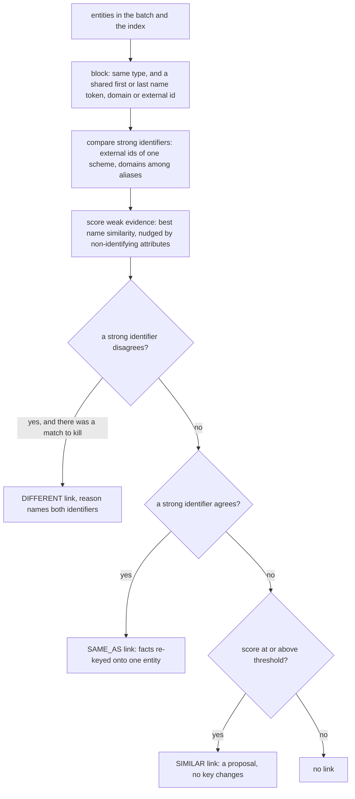

# Resolution & corroboration

After grounding, four stages turn a pile of candidate facts into a graph worth
querying. They run in this order, and the order is deliberate:

1. **Normalise**, per document: one canonical spelling per value, so two sources
   that agree also agree textually.
2. **Resolve**, over the batch: decide which entity keys name the same thing, and
   propose links between the ones that might.
3. **Corroborate**: merge facts that are one claim, count independent sources,
   and decide contested values.
4. **Score**: one confidence per fact, from extraction, grounding and
   corroboration.

Resolution runs before corroboration because `Fact.signature` merges on
`subject.key`: corroboration cannot repair a resolution failure. All four are in
`odke.corroborate`, run on the base install, and are plain classes satisfying
their Protocols in `odke.stages`.

```python
from datetime import UTC, datetime

from odke import Entity, Evidence, Fact, GroundingVerdict, Ontology, SourceTier
from odke.corroborate import (
    EvidenceScorer,
    NativeResolver,
    SignatureCorroborator,
    ValueNormalizer,
)
```

## Nothing is overwritten: the reserved `odke.*` keys

`Fact` is frozen and has no free-form metadata slot, and adding one to a frozen
type is the migration [DECISIONS #4](decisions.md) warns about. `Fact.qualifiers`
is already an open mapping, and a key enters `signature` only when it is named in
`identity_keys`, which a namespaced `odke.` key never is. So each stage records
what it did under one reserved key, instead of discarding what it replaced:

| Key | Constant | On | Written by | Holds |
|---|---|---|---|---|
| `odke.source_form` | `SOURCE_FORM` | `Fact.qualifiers` | `ValueNormalizer` | `{field: (original spelling, ...)}` for every value it rewrote. The corroborator unions them, so every spelling survives a merge. |
| `odke.name_key` | `NAME_KEY` | `Entity.attributes` | `ValueNormalizer` | the name's comparison key; the label stays the display form |
| `odke.conflict` | `CONFLICT` | `Fact.qualifiers` | `SignatureCorroborator` | the decision about a contested value: `status` (`won`, `lost` or `tied`) and a `reason` sentence, plus `to`, `ratio` and `confidence_before` for a loser |
| `odke.score` | `SCORE` | `Fact.qualifiers` | `EvidenceScorer` | the scorer's inputs: `extractor`, `prior_used`, `verdict`, `support`, `conflict` |

The conflict and score stamps are functions of the batch they were computed in.
Running either stage again over its own output starts from the extractor's
confidence, read back from those stamps, so a re-run never compounds a previous
penalty. The resolver ignores `odke.*` attributes when it compares entities. The
Neo4j sink writes the qualifier keys as relationship properties like any other
qualifier, which is why `` r.`odke.conflict` `` can be queried in the
[end-to-end example](https://github.com/deepskandpal/odke/blob/main/examples/e2e/README.md#why-is-this-value-here).

## Normalise

`ValueNormalizer(ontology=None, *, day_first=None, person_types=())` rewrites
`object_value` and every qualifier value into one canonical form each, and stamps
each entity's name comparison key. Without it, "10 December 1815", "1815-12-10"
and "Dec 10, 1815" are three claims with `support = 1` each, where there is one
claim with `support = 3`.

It is deterministic and dependency-free, and **every rule refuses when unsure**. A
value left alone costs a missed merge; a wrong rewrite costs a wrong fact.

| Function | Reads | Canonical form |
|---|---|---|
| `normalize_date(text, *, day_first=None)` | ISO dates and datetimes, `10 December 1815`, `Dec 10, 1815`, `03/04/2020`, `March 2020`, `2020-03` | `1815-12-10`, a month such as `2020-03`, or an ISO datetime; `None` when unsure |
| `normalize_quantity(text)` | `1,234`, `12.5 percent`, `$1.2bn`, `1.5 GiB` | `1234`, `"12.5 %"`, `"1200000000 USD"`, `"1610612736 B"`; `None` when unsure |
| `name_key(text, *, person=False)` | a name | casefolded, accents and punctuation dropped, `S.A.` → `sa`, `&` → `and`. Organisations lose a leading "the" and trailing legal forms; people are reordered from "Last, First" and lose honorifics and generational suffixes |

- An all-numeric day/month date is read only when it is unambiguous (one part
  above 12, or both equal) unless `day_first` settles it: `03/04/2020` is the third
  of April in London and the fourth of March in New York.
- Scale abbreviations apply only to money, because `5 m` is five metres. Byte
  units are case-sensitive, so `Mb` (megabits) is not read as megabytes. A leading
  zero (`0123`) marks an identifier, and it is refused.
- The ontology's range decides what a value may become. A `string` range is left
  verbatim apart from whitespace (a registration number `"0114322"` must not become
  an integer), a `date` range is only read as a date, and a numeric range only as a
  quantity.
- `person_types` names the entity types whose names are people's. Which types
  those are is your schema, not something the package assumes. Initials are kept,
  so `J. Smith` is not made `John Smith`: that is the resolver's call, with a
  score.

```python
from odke.corroborate import name_key, normalize_date, normalize_quantity

assert normalize_date("Dec 10, 1815") == "1815-12-10"
assert normalize_date("03/04/2020") is None
assert normalize_date("03/04/2020", day_first=True) == "2020-04-03"
assert normalize_quantity("$1.2bn") == "1200000000 USD" and normalize_quantity("5 m") is None
assert name_key("Acme, Inc.") == name_key("The Acme Corporation") == "acme"
assert name_key("Lovelace, Ada", person=True) == "ada lovelace"

ontology = Ontology.from_dict(
    {
        "types": {"Person": {}, "Company": {}},
        "predicates": {
            "born": {"domain": ["Person"], "range": "date"},
            "headquarters": {"domain": ["Company"]},
        },
    }
)
ada = Entity(key="p:ada", type="Person", label="Ada Lovelace")
born = ValueNormalizer(ontology, person_types=["Person"]).normalize(
    Fact(subject=ada, predicate="born", object_value="10 December 1815")
)
print(born.object_value, born.qualifiers, born.subject.attributes)
# 1815-12-10 {'odke.source_form': {'object_value': ('10 December 1815',)}} {'odke.name_key': 'ada lovelace'}
```

Normalising is idempotent: normalising a normalised fact changes nothing.

## Resolve

`NativeResolver(*, threshold=0.9, nudge_up=0.05, nudge_down=0.15, max_block=500)`
is the dependency-free resolver. It follows the standard recipe in its standard
order, and adds the two parts the surveyed resolvers leave out: a disagreement
rule, and a refusal to destroy anything ([DECISIONS #16](decisions.md)).



**Blocking** keeps this from being all-pairs. Only entities of one type that share
the first or last token of a name, a domain or an external id are ever compared,
so the work grows with block sizes rather than with the square of the corpus. A
name block larger than `max_block` (a first token like "bank") is split by the
entities' `country` attribute where they carry one, and skipped where it is still
too large. `candidate_pairs(entities)` returns exactly the pairs blocking lets
through, so the cost of a configuration can be measured before it runs.

**Strong identifiers** are `Entity.external_id` and the domains among an entity's
aliases (`https://www.acme.com/about` and `acme.com` are both `acme.com`). An id
may carry a scheme, as in `wikidata:Q95`, and ids from two different schemes
neither match nor disagree.

**Weak evidence** is name similarity on the name keys: the better of a `difflib`
ratio and a token overlap in which an initial matches a word it could abbreviate
for half a token. Each non-identifying attribute the two share adds `nudge_up`
when it agrees and subtracts `nudge_down` when it does not. Disagreement costs
more, for the same reason the disagreement rule exists.

**The disagreement rule.** Two companies called "Acme Corporation GmbH" and "Acme
Corporation Ltd" with registration numbers DE-114322 and GB-889401 are two
companies, and no amount of name similarity outweighs that. Evidence against
beats evidence for, so the pair is recorded as `DIFFERENT` with a `reason` naming
both identifiers: the rejection is a query, not a mystery. A `DIFFERENT` is
recorded only when there was a match to kill (a strong agreement, or a name score
above the threshold), so unrelated entities in one block do not all get links.
The rule also holds across a cluster: a `SAME_AS` that would join two entities
whose ids disagree, through a third that has none, is refused and recorded as
`DIFFERENT`.

**Nothing is destroyed.** Only a `SAME_AS`, which is proof rather than resemblance,
re-keys facts onto one canonical entity, and the other keys, labels and aliases
survive as that entity's aliases. The canonical entity is the one the caller
keyed, then one already in the index, then the smallest key, so a re-run picks the
same one. A `SIMILAR` is a proposal with a score and changes no key. A wrong merge
silently corrupts every query that touches the node, while a missed one costs a
duplicate the link still points at. Thresholds are wrong on the first try, and a
link can be re-run at a new threshold; a merge cannot.

```python
from odke import LinkKind

gmbh = Entity(
    key="c:acme-gmbh", type="Company", label="Acme Corporation GmbH", external_id="DE-114322"
)
ltd = Entity(
    key="c:acme-ltd", type="Company", label="Acme Corporation Ltd", external_id="GB-889401"
)
mention = Entity(
    key="c:acme-corporation", type="Company", label="ACME Corporation", external_id="de-114322"
)
normalizer = ValueNormalizer(ontology)
facts = [
    normalizer.normalize(Fact(subject=e, predicate="headquarters", object_value="Munich"))
    for e in (gmbh, ltd, mention)
]

resolved, links = NativeResolver().resolve(facts, {})
for link in links:
    print(link.kind.value, link.source_key, link.target_key, "|", link.reason)
# different c:acme-corporation c:acme-ltd | external_id mismatch: de-114322 vs GB-889401
# different c:acme-gmbh c:acme-ltd | external_id mismatch: DE-114322 vs GB-889401
# same_as c:acme-corporation c:acme-gmbh | external_id match: de-114322

merged = resolved[0].subject
assert resolved[2].subject.key == merged.key == "c:acme-corporation"  # re-keyed on proof
assert merged.aliases == ("c:acme-gmbh", "Acme Corporation GmbH")  # nothing lost
assert merged.resolution.method == "external_id"
assert resolved[1].subject.resolution.linker == "odke.native"  # compared, not merged
assert LinkKind.SIMILAR not in {link.kind for link in links}  # the ids settled every pair
```

Every returned fact has `Entity.resolution` stamped: `external_id` where a shared
identifier settled a merge, and `linker="odke.native"` otherwise, with
`score=1.0` on a merge decided by a shared domain. An identity decided upstream
keeps its own provenance. The links become `KnowledgeGraph.links`, and the Neo4j
sink writes them as `SAME_AS`, `SIMILAR` and `DIFFERENT` relationships. Scoring a
resolver against your labels, pairwise and with B-cubed, is covered in
[Evaluation](evaluation.md#resolve).

A corpus often has an identifier the package cannot know about. The end-to-end
example's `e2e_stages:RegistryResolver` is twenty lines that stamp each company's
registration number on as its `external_id` and then hand over to
`NativeResolver`, which is how that example's `DIFFERENT` link comes about.

## Corroborate

`SignatureCorroborator(ontology=None, *, source=source_of, half_life_days=365.0,
freshness_floor=0.5, intervals=DEFAULT_INTERVALS)` does two jobs, in order.

### Merge by signature

Facts sharing a `signature` are one claim. The signature already carries polarity
and the identity-bearing qualifiers ([DECISIONS #14](decisions.md),
[#15](decisions.md)), so a denial never merges with its assertion and uptime at
p50 never merges with uptime at p95. Everything else about the claim is
reconciled:

- **Evidence** is unioned.
- **`support`** is the count of *independent sources*, not of mentions.
  `source_of(evidence)` is the host of the evidence's URI, without `www.`, when it
  has one, and otherwise its document. Forty pages from one scraper are one
  source, and two chunks of one document are one. Pass `source=` to decide
  differently.
- **Reconcilable qualifiers** either agree, or take the interval union for the
  keys in `intervals` (`start_time` and `start` the earliest, `end_time` and `end`
  the latest), or take the best-ranked source's value. Every `odke.source_form`
  spelling is kept.
- **The valid clock** takes the earliest `valid_from` and the latest `valid_to`
  any member gave.
- **`verdict`** is the most informative among the members: one supporting span
  supports the claim, and otherwise a contradiction outweighs silence.
- **`confidence`** is the members' maximum, and `extractor` joins their names.

### Contest

Two claims conflict when they share subject and predicate, the predicate is
`single` in the ontology, they agree on its
[`scope_keys`](ontology.md#cardinality-and-its-scope), their objects differ, and
their valid intervals overlap. A denial and an assertion of the same object
conflict on any predicate. Without an ontology, or for a predicate it does not
declare, no *value* is contested, because picking a winner among values that may
all be true is the more harmful mistake. A CEO from 2019 to 2024 and another from
2024 on is a value that changed, not a conflict ([DECISIONS #17](decisions.md)).

Every contested claim gets a rank:

```text
rank      = trust × agreement
trust     = max over its evidence of tier.weight × freshness
freshness = floor + (1 − floor) × 0.5 ^ (age / half_life)
agreement = 1 + ln(1 + Σ_s 1 / (1 + ln n_s))
```

`age` is measured back from the newest evidence in the batch, and `n_s` is the
number of claims source `s` backs in the batch. Agreement is volume-normalised. A
raw count of agreeing sources rewards whoever is loudest, and a scraper emitting
ten thousand facts would outvote a careful filing on every one. Discounting each
source's vote by `1 + ln` of how much it asserts is a one-pass form of Pasternack
and Roth's *Average·Log*: one pass, because the tier already supplies the prior
their iteration exists to learn. With the default floor, freshness can at most
halve trust, so a stale curated record still beats a fresh scrape.

The highest rank wins, and **a loser is kept, never dropped**. Its confidence is
multiplied by `rank / winning rank`, and `odke.conflict` records a sentence saying
why, so a validator or a person can see the losing claim. Equal ranks are `tied`,
and both claims stay at full confidence for someone to settle.

```python
retrieved = datetime(2026, 9, 1, tzinfo=UTC)
halden = Entity(key="c:halden", type="Company", label="Halden Robotics Ltd")


def cited(doc_id, tier, uri=None):
    return (Evidence(doc_id=doc_id, uri=uri, tier=tier, retrieved_at=retrieved),)


candidates = [
    Fact(
        subject=halden,
        predicate="headquarters",
        object_value="Leeds",
        evidence=cited("register.csv#L2", SourceTier.CURATED),
        confidence=1.0,
    ),
    Fact(
        subject=halden,
        predicate="headquarters",
        object_value="Leeds",
        evidence=cited("factsheet.md", SourceTier.AUTHORITATIVE),
        confidence=1.0,
    ),
    Fact(
        subject=halden,
        predicate="headquarters",
        object_value="Sheffield",
        evidence=cited("halden.md", SourceTier.COMMUNITY, "https://trade.example/halden"),
        confidence=0.5,
        verdict=GroundingVerdict.SUPPORTED,
    ),
]
leeds, sheffield = SignatureCorroborator(ontology).corroborate(candidates)

assert (leeds.support, leeds.qualifiers["odke.conflict"]["status"]) == (2, "won")
lost = sheffield.qualifiers["odke.conflict"]
assert (lost["status"], lost["to"], lost["ratio"]) == ("lost", "'Leeds'", 0.4034)
assert round(sheffield.confidence, 4) == round(0.5 * 0.4034, 4)
print(lost["reason"])
# Kept 'Leeds' over 'Sheffield': 'Leeds' is backed by 2 independent sources (the strongest curated, retrieved 2026-09-01) and 'Sheffield' by 1 independent source (community, retrieved 2026-09-01). Ranked on source trust, freshness, and agreement discounted by how much each source asserts: 2.10 to 0.85.
```

## Score

`EvidenceScorer(*, prior=0.5, verdict_weights=DEFAULT_VERDICT_WEIGHTS,
source=source_of)` sets `Fact.confidence` from three signals, monotone and
bounded:

```text
confidence = g(verdict) × (1 − (1 − c) ^ (1 + ln support)) × k
```

- **`c`** is the extractor's confidence, clamped to [0, 1]. Exactly 0.0 is
  `Fact.confidence`'s default and means the extractor reported nothing, so `prior`
  stands in for it.
- **`g`** is what grounding found. It multiplies rather than votes, so no number
  of agreeing sources lifts a claim above what its own cited spans allow.

    | verdict | `g` |
    |---|---|
    | `supported` | 1.0 |
    | `unchecked` | 0.6 |
    | `not_found` | 0.25 |
    | `contradicted` | 0.05 |

- **`support`** is the corroborator's count of independent sources, or the fact's
  own count when no corroborator ran, whichever is larger. It enters as a noisy-OR
  damped by a log in the exponent: two sources count for 1.69 of one and ten for
  3.3, so agreement strengthens a claim without volume alone making it certain.
- **`k`** is 1, except for a value that lost a contest, where it is the loser's
  `ratio`.

Raising `c`, `support`, the verdict or `k` never lowers the score, and every
factor lies in [0, 1]. The inputs are kept under `odke.score`, so a score can be
recomputed, audited and measured, and scoring the same fact twice gives the same
number.

```python
from odke.corroborate import combine

# Worked values at extractor confidence 0.8.
assert round(combine(0.8, 1.0, support=1), 2) == 0.80  # one source, supported
assert round(combine(0.8, 0.6, support=1), 2) == 0.48  # one source, unchecked
assert round(combine(0.8, 0.25, support=1), 2) == 0.20  # one source, not found
assert round(combine(0.8, 1.0, support=3), 2) == 0.97  # three sources, supported
assert round(combine(0.8, 1.0, support=1, conflict=0.35), 2) == 0.28  # lost a contest

scored = EvidenceScorer().score(sheffield)
print(round(scored.confidence, 4), scored.qualifiers["odke.score"])
# 0.2017 {'extractor': 0.5, 'prior_used': False, 'verdict': 1.0, 'support': 1, 'conflict': 0.4034}
```

**What the number means.** Until it has been measured against labels, it is an
ordering: more reason to believe the fact on the evidence this pipeline saw, not
a probability that the fact is true. To pick a threshold, measure it:
`odke eval score` reports the Brier score, a reliability curve and ECE against a
slice you label ([Evaluation](evaluation.md#score)), and the lowest score whose
bin's observed precision clears your bar is the line. Before there are labels,
0.5 is a defensible rough line. It keeps a single confident extraction that a
span supports, and drops an unchecked single-source claim and every loser of a
contest.

## In a pipeline

```python
from odke import Document, Pipeline


class Replay:
    """Stands in for an extractor: the three candidates above."""

    def extract(self, chunk, ontology):
        return candidates


pipeline = Pipeline(
    ontology,
    Replay(),
    normalizer=ValueNormalizer(ontology),
    resolver=NativeResolver(),
    corroborator=SignatureCorroborator(ontology),
    scorer=EvidenceScorer(),
)
graph = pipeline.run([Document(text="Halden Robotics Ltd has its head office in Leeds.")])
assert [(f.object_value, f.support) for f in graph.facts] == [("Leeds", 2), ("Sheffield", 1)]
```

In an `odke run` config the same four are `normalizer: value`, `resolver: native`,
`corroborator: signature` and `scorer: evidence`, with their options as extra
keys; `odke run` supplies the ontology itself. A run's contested values show up in
its stats, as `corroborator: conflicts (lost 1, won 2)`.
