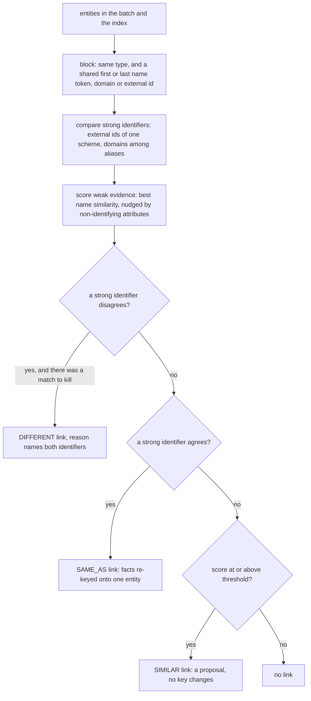

# Resolution & corroboration

After grounding, four stages turn a pile of candidate facts into a graph worth
querying. They run in this order, and the order is deliberate:

1. **Normalise**, per document: one canonical spelling per value, so two sources
   that agree also agree textually.
2. **Resolve**, over the batch: decide which entity keys name the same thing, and
   propose links between the ones that might.
3. **Corroborate**: merge facts that are one claim, count independent sources,
   and decide contested values.
4. **Score**: one confidence per fact, from extraction, grounding and
   corroboration.

Resolution runs before corroboration because `Fact.signature` merges on
`subject.key`: corroboration cannot repair a resolution failure. All four are in
`openodke.corroborate`, run on the base install, and are plain classes satisfying
their Protocols in `openodke.stages`.

```python
from datetime import UTC, datetime

from openodke import Entity, Evidence, Fact, GroundingVerdict, Ontology, SourceTier
from openodke.corroborate import (
    EvidenceScorer,
    NativeResolver,
    SignatureCorroborator,
    ValueNormalizer,
)
```

## Nothing is overwritten: the reserved `odke.*` keys

`Fact` is frozen and has no free-form metadata slot, and adding one to a frozen
type is the migration [DECISIONS #4](decisions.md#4) warns about. `Fact.qualifiers`
is already an open mapping, and a key enters `signature` only when it is named in
`identity_keys`, which a namespaced `odke.` key never is. So each stage records
what it did under one reserved key, instead of discarding what it replaced:

| Key | Constant | On | Written by | Holds |
|---|---|---|---|---|
| `odke.source_form` | `SOURCE_FORM` | `Fact.qualifiers` | `ValueNormalizer` | `{field: (original spelling, ...)}` for every value it rewrote. The corroborator unions them, so every spelling survives a merge. |
| `odke.name_key` | `NAME_KEY` | `Entity.attributes` | `ValueNormalizer` | the name's comparison key; the label stays the display form |
| `odke.conflict` | `CONFLICT` | `Fact.qualifiers` | `SignatureCorroborator` | the decision about a contested value: `status` (`won`, `lost` or `tied`) and a `reason` sentence, plus `to`, `ratio` and `confidence_before` for a loser |
| `odke.score` | `SCORE` | `Fact.qualifiers` | `EvidenceScorer` | the scorer's inputs: `extractor`, `prior_used`, `verdict`, `support`, `conflict` |
| `odke.derived` | `DERIVED` | `Fact.qualifiers` | the pipeline's [inverse step](concepts.md#inverse-and-symmetric-partners) | `rule` (`inverse` or `symmetric`) and `of`, the signature of the stated fact this one was derived from |
| `odke.widen` | `WIDEN` | `Fact.qualifiers` | `LLMGrounder(widen=True)` | one [widen-and-retry](grounding.md#widen-and-retry) attempt: `from` and `to` as `[start, end]`, and the retry's `verdict`; the span is the wider one only when that verdict is `supported` |
| `odke.near_duplicates` | `NEAR_DUPLICATES` | `Fact.qualifiers` | `SignatureCorroborator` | the groups of evidence documents found to be [near-duplicates](#near-duplicate-sources), each a sorted tuple of document ids; each group counts as one source |

The conflict and score stamps are functions of the batch they were computed in.
Running either stage again over its own output starts from the extractor's
confidence, read back from those stamps, so a re-run never compounds a previous
penalty. The resolver ignores `odke.*` attributes when it compares entities. The
Neo4j sink writes the qualifier keys as relationship properties like any other
qualifier, which is why `` r.`odke.conflict` `` can be queried in the
[end-to-end example](https://github.com/deepskandpal/odke/blob/main/examples/e2e/README.md#why-is-this-value-here).

## Normalise

`ValueNormalizer(ontology=None, *, day_first=None, person_types=())` rewrites
`object_value` and every qualifier value into one canonical form each, and stamps
each entity's name comparison key. The interval bounds the corroborator reconciles
(`start_time`, `start`, `end_time`, `end`) are read only as dates, so a bare year
stays `"2019"` rather than become the number 2019, which no ISO date can be
ordered against. Without it, "10 December 1815", "1815-12-10"
and "Dec 10, 1815" are three claims with `support = 1` each, where there is one
claim with `support = 3`.

It is deterministic and dependency-free, and **every rule refuses when unsure**. A
value left alone costs a missed merge; a wrong rewrite costs a wrong fact.

| Function | Reads | Canonical form |
|---|---|---|
| `normalize_date(text, *, day_first=None)` | ISO dates and datetimes, `10 December 1815`, `Dec 10, 1815`, `03/04/2020`, `March 2020`, `2020-03` | `1815-12-10`, a month such as `2020-03`, or an ISO datetime; `None` when unsure |
| `normalize_quantity(text)` | `1,234`, `5 km`, `12.5 percent`, `€1.2bn`, `1.5 GiB` | `1234`, `"5000 m"`, `"12.5 %"`, `"1200000000 EUR"`, `"1610612736 B"`; `None` when unsure |
| `name_key(text, *, person=False)` | a name | casefolded, accents and punctuation dropped, `S.A.` → `sa`, `&` → `and`. Organisations lose a leading "the" and trailing legal forms; people are reordered from "Last, First" and lose honorifics and generational suffixes |

- An all-numeric day/month date is read only when it is unambiguous (one part
  above 12, or both equal) unless `day_first` settles it: `03/04/2020` is the third
  of April in London and the fourth of March in New York.
- Scale abbreviations apply only to money, because `5 m` is five metres. Unit
  symbols are case-sensitive, as SI writes them, so `Mb` (megabits) is not read as
  megabytes. A leading zero (`0123`) marks an identifier, and it is refused.
- The ontology's range decides what a value may become. A `string` range is left
  verbatim apart from whitespace (a registration number `"0114322"` must not become
  an integer), a `date` range is only read as a date, and a numeric or `quantity`
  range only as a quantity.
- `person_types` names the entity types whose names are people's. Which types
  those are is your schema, not something the package assumes. Initials are kept,
  so `J. Smith` is not made `John Smith`: that is the resolver's call, with a
  score.

**Units.** A number with a unit becomes `"<number> <unit>"` in one unit per
dimension: metres, kilograms and seconds, bytes for data, and `%`. The arithmetic
is `Decimal`, so `5 km`, `5,000 m` and `5000 metres` are all `"5000 m"`, and a
length never meets a mass. `KB` is 1,000 bytes, as SI says, and only `KiB` is
1,024. A year is a unit of its own, because it has no fixed length in seconds.
Currency is never converted. A symbol becomes an ISO code only when one currency
owns it (`€`, `£`, `₹`, `US$`); `$`, `¥` and `Rs` are kept as written, after the
amount. Numbers are read in English notation, with a dot decimal and comma
thousands. Anything outside the table stays as written: temperature, `pound`,
`ton`, months, a decimal comma. A predicate whose values carry units wants the
range `quantity`: it is text to the model, so the unit survives structured
output, where a `number` range would drop it.

```python
from openodke.corroborate import name_key, normalize_date, normalize_quantity

assert normalize_date("Dec 10, 1815") == "1815-12-10"
assert normalize_date("03/04/2020") is None
assert normalize_date("03/04/2020", day_first=True) == "2020-04-03"
assert normalize_quantity("5 km") == normalize_quantity("5,000 metres") == "5000 m"
assert normalize_quantity("$1.2bn") == "1200000000 $" and normalize_quantity("5 °C") is None
assert name_key("Acme, Inc.") == name_key("The Acme Corporation") == "acme"
assert name_key("Lovelace, Ada", person=True) == "ada lovelace"

ontology = Ontology.from_dict(
    {
        "types": {"Person": {}, "Company": {}},
        "predicates": {
            "born": {"domain": ["Person"], "range": "date"},
            "headquarters": {"domain": ["Company"]},
        },
    }
)
ada = Entity(key="p:ada", type="Person", label="Ada Lovelace")
born = ValueNormalizer(ontology, person_types=["Person"]).normalize(
    Fact(subject=ada, predicate="born", object_value="10 December 1815")
)
print(born.object_value, born.qualifiers, born.subject.attributes)
# 1815-12-10 {'odke.source_form': {'object_value': ('10 December 1815',)}} {'odke.name_key': 'ada lovelace'}
```

Normalising is idempotent: normalising a normalised fact changes nothing.

## Resolve

`NativeResolver(*, threshold=0.9, nudge_up=0.05, nudge_down=0.15, max_block=100)`
is the dependency-free resolver. It follows the standard recipe in its standard
order, and adds the two parts the surveyed resolvers leave out: a disagreement
rule, and a refusal to destroy anything ([DECISIONS #16](decisions.md#16)).


```mermaid
flowchart TD
  e[entities in the batch and the index] --> block
  block["block: same type, and a shared first or last name token, domain or external id"] --> strong
  strong["compare strong identifiers: external ids of one scheme, domains among aliases"] --> weak
  weak["score weak evidence: best name similarity, nudged by non-identifying attributes"] --> against
  against{"a strong identifier disagrees?"}
  against -- "yes, and there was a match to kill" --> different["DIFFERENT link, reason names both identifiers"]
  against -- no --> agree{"a strong identifier agrees?"}
  agree -- yes --> same["SAME_AS link: facts re-keyed onto one entity"]
  agree -- no --> bar{"score at or above threshold?"}
  bar -- yes --> similar["SIMILAR link: a proposal, no key changes"]
  bar -- no --> nothing[no link]
```

**Blocking** keeps this from being all-pairs. Only entities of one type that share
the first or last token of a name, a domain or an external id are ever compared,
so the work grows with block sizes rather than with the square of the corpus. A
name block larger than `max_block` (a first token like "bank") is split by the
entities' `country` attribute where they carry one, and skipped where it is still
too large. A block is compared pair by pair, so the cap is what bounds the work:
100 entities are 4,950 comparisons, where 500 would be 124,750. `candidate_pairs(entities)` returns exactly the pairs blocking lets
through, so the cost of a configuration can be measured before it runs.

**Strong identifiers** are `Entity.external_id` and the domains among an entity's
aliases (`https://www.acme.com/` and `acme.com` are both `acme.com`). A URL with a
path names a page on a host, not the host, so two profile pages on one site
(`https://www.linkedin.com/in/alice-chen`, `https://linkedin.com/in/bobdiaz`) are
compared as names and are never proof. An id may carry a scheme, as in
`wikidata:Q95`, and ids from two different schemes neither match nor disagree.

**Weak evidence** is name similarity on the name keys: the better of a `difflib`
ratio and a token overlap in which an initial matches a word it could abbreviate
for half a token. Each non-identifying attribute the two share adds `nudge_up`
when it agrees and subtracts `nudge_down` when it does not. Disagreement costs
more, for the same reason the disagreement rule exists.

**The disagreement rule.** Two companies called "Acme Corporation GmbH" and "Acme
Corporation Ltd" with registration numbers DE-114322 and GB-889401 are two
companies, and no amount of name similarity outweighs that. Evidence against
beats evidence for, so the pair is recorded as `DIFFERENT` with a `reason` naming
both identifiers: the rejection is a query, not a mystery. A `DIFFERENT` is
recorded only when there was a match to kill (a strong agreement, or a name score
above the threshold), so unrelated entities in one block do not all get links.
The rule also holds across a cluster: a `SAME_AS` that would join two entities
whose ids disagree, through a third that has none, is refused and recorded as
`DIFFERENT`.

**Nothing is destroyed.** Only a `SAME_AS`, which is proof rather than resemblance,
re-keys facts onto one canonical entity, and the other keys, labels and aliases
survive as that entity's aliases. The canonical entity is the one the caller
keyed, then one already in the index, then the smallest key, so a re-run picks the
same one. A `SIMILAR` is a proposal with a score and changes no key. A wrong merge
silently corrupts every query that touches the node, while a missed one costs a
duplicate the link still points at. Thresholds are wrong on the first try, and a
link can be re-run at a new threshold; a merge cannot.

```python
from openodke import LinkKind

gmbh = Entity(
    key="c:acme-gmbh", type="Company", label="Acme Corporation GmbH", external_id="DE-114322"
)
ltd = Entity(
    key="c:acme-ltd", type="Company", label="Acme Corporation Ltd", external_id="GB-889401"
)
mention = Entity(
    key="c:acme-corporation", type="Company", label="ACME Corporation", external_id="de-114322"
)
normalizer = ValueNormalizer(ontology)
facts = [
    normalizer.normalize(Fact(subject=e, predicate="headquarters", object_value="Munich"))
    for e in (gmbh, ltd, mention)
]

resolved, links = NativeResolver().resolve(facts, {})
for link in links:
    print(link.kind.value, link.source_key, link.target_key, "|", link.reason)
# different c:acme-corporation c:acme-ltd | external_id mismatch: de-114322 vs GB-889401
# different c:acme-gmbh c:acme-ltd | external_id mismatch: DE-114322 vs GB-889401
# same_as c:acme-corporation c:acme-gmbh | external_id match: de-114322

merged = resolved[0].subject
assert resolved[2].subject.key == merged.key == "c:acme-corporation"  # re-keyed on proof
assert merged.aliases == ("c:acme-gmbh", "Acme Corporation GmbH")  # nothing lost
assert merged.resolution.method == "external_id"
assert resolved[1].subject.resolution.linker == "odke.native"  # compared, not merged
assert LinkKind.SIMILAR not in {link.kind for link in links}  # the ids settled every pair
```

Every returned fact has `Entity.resolution` stamped: `external_id` where a shared
identifier settled a merge, and `linker="odke.native"` otherwise, with
`score=1.0` on a merge decided by a shared domain. An identity decided upstream
keeps its own provenance. The links become `KnowledgeGraph.links`, and the Neo4j
sink writes them as `SAME_AS`, `SIMILAR` and `DIFFERENT` relationships. Scoring a
resolver against your labels, pairwise and with B-cubed, is covered in
[Evaluation](evaluation.md#resolve).

A corpus often has an identifier the package cannot know about. The end-to-end
example's `e2e_stages:RegistryResolver` is twenty lines that stamp each company's
registration number on as its `external_id` and then hand over to
`NativeResolver`, which is how that example's `DIFFERENT` link comes about.

### Resolving against the store

`NativeResolver(lookup=...)` also resolves the batch against what the store
already holds, without loading it ([DECISIONS #31](decisions.md#31)). A
`StoreLookup` returns, for each entity, the store's entities sharing one of its
block keys (`block_keys(entity)`: its key, an external id, a domain, the first
or last name token), within its type and, when scoped, its tenant. Each pair is
judged by the rules above:

- **A proof re-keys the incoming facts**, never the store. A shared id or
  domain moves them onto the stored key, carrying the stored entity exactly as
  the store holds it, so writing them changes nothing on the node. The
  `SAME_AS` link keeps the incoming key and the reason. A batch that states the
  stored key itself, or a key the caller chose (`method="caller"`), keeps its
  own entity, as it would with no store.
- **Anything weaker is a `SIMILAR` link**, at the same `threshold`; no key
  moves. A disagreeing id is a `DIFFERENT` link.
- **Never across types, and never store against store.**

```python
from openodke.corroborate import MemoryLookup

acme = Entity(key="c:acme", type="Company", label="Acme Corporation", aliases=("acme.com",))
widgets = Entity(key="c:widgets", type="Company", label="Acme Widgets")
store = MemoryLookup({e.key: e for e in (acme, widgets)})
batch = [
    Entity(key="c:acme-inc", type="Company", label="ACME Inc.", aliases=("https://acme.com/",)),
    Entity(key="c:acme-widget", type="Company", label="Acme Widget"),
]
resolver = NativeResolver(lookup=store)
resolved, links = resolver.resolve(
    [Fact(subject=e, predicate="headquarters", object_value="Leeds") for e in batch], {}
)
for link in links:
    print(link.kind.value, link.source_key, link.target_key, link.score)
# similar c:acme-widget c:widgets 0.9565
# same_as c:acme-inc c:acme 1.0

assert resolved[0].subject == acme  # the stored entity, as stored
assert resolved[1].subject.key == "c:acme-widget"  # a link, not a merge
assert resolver.stats["store"]["rekeyed"] == 1
```

`MemoryLookup(index, *, tenant=None, tenant_property="tenant", limit=100,
embed=None, vector_k=5)` is the store in memory: today's `EntityIndex` mapping,
blocked once. `Neo4jLookup`, or `Neo4jSink.lookup(**options)` on the sink's own
connection, reads a graph the sink wrote. It reads the store's indexes once
(`SHOW INDEXES`), then each batch in one read transaction: per type, an
`UNWIND` of the batch's distinct block keys through the key constraint, the
`external_id` index (the id as written and in each case), and the
`odke_names_<Type>` full-text index (`limit` hits a token). `bootstrap()`
creates all three. A type without one is not read, with a warning: nothing is
scanned and nothing is written.

<!-- docs: no-run -->
```python
with Neo4jSink(uri, auth, ontology=ontology) as sink:
    sink.bootstrap(ontology)
    validator = Validator(ontology, lookup=sink.lookup(tenant="acme"), sinks=[sink])
    kg, report = validator.validate(rows, documents)  # report.store: what it found
```

- **Tenant** keeps the nodes whose `tenant_property` equals `tenant`. Tenant
  keys arrive in 0.7.0 (#159); until then it is a filter on a property, and in
  Neo4j it applies after the full-text `limit`.
- **Vectors** are a slot, not a dependency. With `embed`, a function from
  texts to vectors, the `vector_k` nearest stored labels of the same type are
  candidates too (in Neo4j, from a `vector_index` you keep; openodke writes no
  embeddings). They are judged like any candidate: an embedding widens what is
  compared, never what counts as a match.
- **The defaults are defaults, not findings:** the `SIMILAR` bar is the
  resolver's 0.9, a token returns 100 hits (`max_block`'s 100), and
  `vector_k` is 5, all set before anything was measured.

The one measurement so far is `bench/store_lookup.py` on Re-DocRED's 500 test
documents. Its identity is within a document, so each document's first half
of sentences is the store (4,619 entities, one tenant per document) and its
second half the batch (3,777 mentions, 968 of them of a stored entity). There
are no ids, so every link is a `SIMILAR`:

| threshold | links | link precision | link recall |
|---|---|---|---|
| 0.8 | 867 | 89.9% | 80.5% |
| 0.9 (default) | 807 | 95.3% | 79.4% |
| 1.0 | 776 | 97.9% | 78.5% |

Of the 38 wrong links at 0.9, 16 join two entities Re-DocRED gives one name
key ("the United States" and "United States"); the rest are near names that
differ by a number or a suffix ("1900" and "1903 County Championship", "South
Africa" and "South African"). The misses are surnames, abbreviations and
demonyms ("Lovelace", "UK", "German"). Identity across documents, and the
proof path, are measured on T-REx with Wikidata ids in 0.6.0 (#117). In a run
config the option is [`store_lookup`](run.md#store_lookup).

### The pair judge

`NativeResolver(judge=PairJudge(...))` puts the pairs the rules leave open to a
model ([DECISIONS #34](decisions.md#34)). A pair is open when no id or domain
settled it either way and its name score is in the band from the judge's
`low` (0.7) up to the resolver's `threshold` (0.9). Above the band the rules
stand, below it nothing is asked, and a pair whose ids disagree is never asked.

- **Both orders.** Each pair is asked as (A, B) and as (B, A), against a
  model's position bias. "same" counts only when both orders say same, and
  "different" only when both say different. Anything else is unsure: the
  orders disagree, one says unsure, or an answer could not be read.
- **What it makes.** "same" is a `SIMILAR` link with the resolver's name score
  and a reason naming the judge, its prompt and its model; never a merge, since
  only a proof re-keys. "different" is a `DIFFERENT` link. Unsure is no link,
  and neither is a call that failed, which the next run asks again.
- **What the model reads.** The registered `pair@1` and its user message
  `pair.user@1` ([Prompts](models.md#prompts)): each mention's name, its type,
  and its sentence with one either side, from the document its fact cites.
  `judge.documents` holds the texts; `odke run` and the Validator fill it, and
  the quote on a span stands in when a document is missing. An entity no fact
  of the batch mentions is a stored one: it shows its aliases, and its context
  is what `store_context(entity)` returns, meant as the evidence of its
  strongest supporting fact. The store keeps offsets, not passages, so without
  it a stored entity has none. A side with no context is never asked.
- **The review queue.** With `queue=`, every unsure pair is appended to a
  JSONL file, once, in the row format `odke label make pair` reads, with the
  judge's two answers under `judge`, which the sheet does not show. Ticked and
  read back with `odke label read`, the labels are `reviewed=`: a pair a person
  decided is decided in the judge's place with no call, and its link's reason
  starts `person:`. A person's same is a `SIMILAR` too.
- **The model** is the `ground` role's, the same size of question, asked for
  `{"because": …, "decision": …}`. A call is retried as the grounder's are; a
  missing key raises rather than failing every pair. A budget stop ends the
  calls and not the resolver: a pair it reached is `unasked`, makes no link,
  is not queued and is asked by the next run, and a stop the judge reached
  first is the run's `stopped`, during resolve.

```python
from openodke import Document, Span
from openodke.corroborate import PairJudge
from openodke.llm import RecordedClient

bio = Document(
    id="bio",
    text="Ada Lovelace wrote the first program. She worked with Charles Babbage. "
    "Lovelace died in London in 1852.",
)


def cited(entity, quote):
    start = bio.text.index(quote)
    span = Span(doc_id="bio", start=start, end=start + len(quote))
    return Fact(
        subject=entity, predicate="mentioned", object_value=quote,
        evidence=(Evidence(doc_id="bio", span=span),),
    )  # fmt: skip


ada = Entity(key="p:ada", type="Person", label="Ada Lovelace")
surname = Entity(key="p:lovelace", type="Person", label="Lovelace")
# Recorded answers, by the mention each order names first. Drop `client=` to call a model.
client = RecordedClient(
    [
        {"match": 'Mention A: "Ada', "response": {"because": "one woman", "decision": "same"}},
        {"match": 'Mention A: "Lov', "response": {"because": "her surname", "decision": "same"}},
    ]
)
judge = PairJudge(client=client)
judge.documents[bio.id] = bio
resolver = NativeResolver(judge=judge)
facts = [cited(ada, "Ada Lovelace wrote the first program."), cited(surname, "Lovelace died")]
resolved, links = resolver.resolve(facts, {})
for link in links:
    print(link.kind.value, link.source_key, link.target_key, link.score)
    print(link.reason)
# similar p:ada p:lovelace 0.8
# pair judge (pair@1, anthropic/claude-haiku-4-5-20251001): same in both orders; one woman

assert [f.subject.key for f in resolved] == ["p:ada", "p:lovelace"]  # a link, not a merge
assert resolver.stats["judge"]["calls"] == 2 and resolver.stats["judge"]["swapped"] == 1
```

The first of the two calls sent this, and the second the same with the two
mentions swapped:

```text
Mention A: "Ada Lovelace" (type: Person)
Context A: Ada Lovelace wrote the first program. She worked with Charles Babbage.

Mention B: "Lovelace" (type: Person)
Context B: She worked with Charles Babbage. Lovelace died in London in 1852.
```

`resolver.stats["judge"]` counts the pairs handed in and `asked`, the `calls`,
the `swapped` ones (the (B, A) calls), the pairs whose orders `disagreed`,
each decision, `person`, `queued`, `no_context`, `failed` calls,
`unparseable` answers, tokens and cost; with a response cache, the `cached`
calls; after a budget stop, the `unasked` calls and the stop as `stopped`.
`stats["prompts"]` names the two keys. `judge.decisions` keeps every `PairDecision`, with both answers. In a run
config the judge is an option of the native resolver,
[`resolver: {use: native, judge: …}`](run.md#the-pair-judge). The band's 0.7
was read off Re-DocRED's dev split, where 533 of 2,076 blocked pairs fall in
it, nearly a third of them one entity; the calibration card on label set R
(#151) is where the judge and the band are measured.

## Corroborate

`SignatureCorroborator(ontology=None, *, source=source_of, half_life_days=365.0,
freshness_floor=0.5, intervals=DEFAULT_INTERVALS, documents=None,
near_duplicates=0.9, store=None)` does two jobs, in order. With `store`, a
`FactLookup` or several, it also merges each claim with the one the store
already holds under its signature, between the two
([Merge with the store](stores.md#merge-with-the-store)).

### Merge by signature

Facts sharing a `signature` are one claim. The signature already carries polarity
and the identity-bearing qualifiers ([DECISIONS #14](decisions.md#14),
[#15](decisions.md#15)), so a denial never merges with its assertion and uptime at
p50 never merges with uptime at p95. Everything else about the claim is
reconciled:

- **Evidence** is unioned.
- **`support`** is the count of *independent sources*, not of mentions.
  `source_of(evidence)` is the host of the evidence's URI, without `www.`, when it
  has one, and otherwise its document. Forty pages from one scraper are one
  source, and two chunks of one document are one. Pass `source=` to decide
  differently.
- **`supported_by`** names those sources: the [support list](#support-lists).
- **Reconcilable qualifiers** either agree, or take the interval union for the
  keys in `intervals` (`start_time` and `start` the earliest, `end_time` and `end`
  the latest), or take the best-ranked source's value. Every `odke.source_form`
  spelling is kept.
- **The valid clock** takes the earliest `valid_from` and the latest `valid_to`
  any member gave.
- **`verdict`** is the most informative among the members: one supporting span
  supports the claim, and otherwise a contradiction outweighs silence.
- **`confidence`** is the members' maximum, and `extractor` joins their names.

#### Near-duplicate sources

A page copied to another host, or a document re-saved with a few words changed,
is not a second source, so it counts once toward `support`. Given the texts
(`documents=`, by `Document.id`), the corroborator compares the documents behind
each claim: two from different sources are one when the Jaccard similarity of
their 5-word shingle sets is at least `near_duplicates` (0.9; `None` turns it
off). One changed word in 200 scores 0.95, and two articles that share a quoted
sentence score near zero. Only documents that back the same claim are compared,
each pair once, so the check never runs over all pairs in the batch. Every
document's evidence is kept, and `odke.near_duplicates` names the group. A
group's trust is its best member's tier, because trust is the maximum over the
evidence. The scorer reads the same count. `odke run` and the Validator hand
the corroborator the texts they load, and `stats["near_duplicates"]` counts the
pairs compared and found.

#### Support lists

`Fact.supported_by` is a tuple of `Support`, one per independent source, so
`support == len(supported_by)` whenever it is filled
([DECISIONS #33](decisions.md#33)). The [reconciler](stores.md#reconcile) reads it
when a source changes or disappears: which facts lose support, and whether
anything is left.

| `Support` field | Holds |
|---|---|
| `source` | the key the corroborator grouped on: a host, `doc:<id>` for a document with no URI, or a near-duplicate group's least key |
| `doc_ids` | that source's documents the fact cites, sorted |
| `tier` | the best tier among their evidence |
| `retrieved_at` | the newest clock among their evidence: the last time this source confirmed the claim |

- **The list is the evidence, counted.** `support_of(evidence, groups, source)`
  gives it, by the same rules as `support`. A group of near-duplicates is one
  entry naming every copy. Entries are sorted by `source`.
- **A derived fact shares its parent's list.** It cites the same evidence, so
  it names the same sources and adds none ([DECISIONS #28](decisions.md#28)).
- **A source that cannot be named empties the list.** A claim with a member
  that cites nothing keeps its count, and `supported_by` stays empty rather
  than name some sources and not others. So does a fact no corroborator
  merged, and one serialised by 0.2.x, which still loads.
- **The scorer keeps a listed count.** `EvidenceScorer` recounts `support`
  only for a fact with no list.

```python
from openodke import Support

two = [
    Fact(
        subject=ada,
        predicate="born",
        object_value="1815-12-10",
        evidence=(Evidence(doc_id=doc, uri=uri, retrieved_at=datetime(2026, 9, day, tzinfo=UTC)),),
    )
    for doc, uri, day in (
        ("bio.md", "https://www.example.org/ada", 1),
        ("register.csv#L2", None, 2),
    )
]
(born,) = SignatureCorroborator().corroborate(two)
for entry in born.supported_by:
    print(entry.source, entry.doc_ids, entry.retrieved_at.date())
# doc:register.csv#L2 ('register.csv#L2',) 2026-09-02
# example.org ('bio.md',) 2026-09-01
assert born.support == len(born.supported_by) == 2
assert isinstance(born.supported_by[0], Support)
```

Every sink writes the list. JSONL keeps it as it is; Neo4j, the bulk sinks and
NetworkX as parallel `support_*` properties on the relationship, which
`openodke.sinks.neo4j.support_from(props)` reads back; RDF as an `odke:Support`
node per source ([Provenance on every fact](stores.md#provenance-on-every-fact)).

### Contest

Two claims conflict when they share subject and predicate, the predicate is
`single` in the ontology, they agree on its
[`scope_keys`](ontology.md#cardinality-and-its-scope), their objects differ, and
their valid intervals overlap. A denial and an assertion of the same object
conflict on any predicate. Without an ontology, or for a predicate it does not
declare, no *value* is contested, because picking a winner among values that may
all be true is the more harmful mistake. A CEO from 2019 to 2024 and another from
2024 on is a value that changed, not a conflict ([DECISIONS #17](decisions.md#17)).

Every contested claim gets a rank:

```text
rank      = trust × agreement
trust     = max over its evidence of tier.weight × freshness
freshness = floor + (1 − floor) × 0.5 ^ (age / half_life)
agreement = 1 + ln(1 + Σ_s 1 / (1 + ln n_s))
```

`age` is measured back from the newest evidence in the batch, and `n_s` is the
number of claims source `s` backs in the batch. Agreement is volume-normalised. A
raw count of agreeing sources rewards whoever is loudest, and a scraper emitting
ten thousand facts would outvote a careful filing on every one. Discounting each
source's vote by `1 + ln` of how much it asserts is a one-pass form of Pasternack
and Roth's *Average·Log*: one pass, because the tier already supplies the prior
their iteration exists to learn. With the default floor, freshness can at most
halve trust, so a stale curated record still beats a fresh scrape.

The highest rank wins, and **a loser is kept, never dropped**. Its confidence is
multiplied by `rank / winning rank`, and `odke.conflict` records a sentence saying
why, so the gate or a person can see the losing claim. Equal ranks are `tied`,
and both claims stay at full confidence for someone to settle.

```python
retrieved = datetime(2026, 9, 1, tzinfo=UTC)
halden = Entity(key="c:halden", type="Company", label="Halden Robotics Ltd")


def cited(doc_id, tier, uri=None):
    return (Evidence(doc_id=doc_id, uri=uri, tier=tier, retrieved_at=retrieved),)


candidates = [
    Fact(
        subject=halden,
        predicate="headquarters",
        object_value="Leeds",
        evidence=cited("register.csv#L2", SourceTier.CURATED),
        confidence=1.0,
    ),
    Fact(
        subject=halden,
        predicate="headquarters",
        object_value="Leeds",
        evidence=cited("factsheet.md", SourceTier.AUTHORITATIVE),
        confidence=1.0,
    ),
    Fact(
        subject=halden,
        predicate="headquarters",
        object_value="Sheffield",
        evidence=cited("halden.md", SourceTier.COMMUNITY, "https://trade.example/halden"),
        confidence=0.5,
        verdict=GroundingVerdict.SUPPORTED,
    ),
]
leeds, sheffield = SignatureCorroborator(ontology).corroborate(candidates)

assert (leeds.support, leeds.qualifiers["odke.conflict"]["status"]) == (2, "won")
lost = sheffield.qualifiers["odke.conflict"]
assert (lost["status"], lost["to"], lost["ratio"]) == ("lost", "'Leeds'", 0.4034)
assert round(sheffield.confidence, 4) == round(0.5 * 0.4034, 4)
print(lost["reason"])
# Kept 'Leeds' over 'Sheffield': 'Leeds' is backed by 2 independent sources (the strongest curated, retrieved 2026-09-01) and 'Sheffield' by 1 independent source (community, retrieved 2026-09-01). Ranked on source trust, freshness, and agreement discounted by how much each source asserts: 2.10 to 0.85.
```

## Score

`EvidenceScorer(*, prior=0.5, verdict_weights=DEFAULT_VERDICT_WEIGHTS,
source=source_of)` sets `Fact.confidence` from three signals, monotone and
bounded:

```text
confidence = g(verdict) × (1 − (1 − c) ^ (1 + ln support)) × k
```

- **`c`** is the extractor's confidence, clamped to [0, 1]. Exactly 0.0 is
  `Fact.confidence`'s default and means the extractor reported nothing, so `prior`
  stands in for it.
- **`g`** is what grounding found. It multiplies rather than votes, so no number
  of agreeing sources lifts a claim above what its own cited spans allow.

    | verdict | `g` |
    |---|---|
    | `supported` | 1.0 |
    | `unchecked` | 0.6 |
    | `not_found` | 0.25 |
    | `contradicted` | 0.05 |

- **`support`** is the corroborator's count of independent sources, or the fact's
  own count when no corroborator ran, whichever is larger. It enters as a noisy-OR
  damped by a log in the exponent: two sources count for 1.69 of one and ten for
  3.3, so agreement strengthens a claim without volume alone making it certain.
- **`k`** is 1, except for a value that lost a contest, where it is the loser's
  `ratio`.

Raising `c`, `support`, the verdict or `k` never lowers the score, and every
factor lies in [0, 1]. The inputs are kept under `odke.score`, so a score can be
recomputed, audited and measured, and scoring the same fact twice gives the same
number.

```python
from openodke.corroborate import combine

# Worked values at extractor confidence 0.8.
assert round(combine(0.8, 1.0, support=1), 2) == 0.80  # one source, supported
assert round(combine(0.8, 0.6, support=1), 2) == 0.48  # one source, unchecked
assert round(combine(0.8, 0.25, support=1), 2) == 0.20  # one source, not found
assert round(combine(0.8, 1.0, support=3), 2) == 0.97  # three sources, supported
assert round(combine(0.8, 1.0, support=1, conflict=0.35), 2) == 0.28  # lost a contest

scored = EvidenceScorer().score(sheffield)
print(round(scored.confidence, 4), scored.qualifiers["odke.score"])
# 0.2017 {'extractor': 0.5, 'prior_used': False, 'verdict': 1.0, 'support': 1, 'conflict': 0.4034}
```

**What the number means.** Until it has been measured against labels, it is an
ordering: more reason to believe the fact on the evidence this pipeline saw, not
a probability that the fact is true. To pick a threshold, measure it:
`odke eval score` reports the Brier score, a reliability curve and ECE against a
slice you label ([Evaluation](evaluation.md#score)), and the lowest score whose
bin's observed precision clears your bar is the line. Before there are labels,
0.5 is a defensible rough line. It keeps a single confident extraction that a
span supports, and drops an unchecked single-source claim and every loser of a
contest.

## In a pipeline

```python
from openodke import Document, Pipeline


class Replay:
    """Stands in for an extractor: the three candidates above."""

    def extract(self, chunk, ontology):
        return candidates


pipeline = Pipeline(
    ontology,
    Replay(),
    normalizer=ValueNormalizer(ontology),
    resolver=NativeResolver(),
    corroborator=SignatureCorroborator(ontology),
    scorer=EvidenceScorer(),
)
graph = pipeline.run([Document(text="Halden Robotics Ltd has its head office in Leeds.")])
assert [(f.object_value, f.support) for f in graph.facts] == [("Leeds", 2), ("Sheffield", 1)]
```

In an [`odke run`](run.md) config the same four are `normalizer: value`, `resolver: native`,
`corroborator: signature` and `scorer: evidence`, with their options as extra
keys; `odke run` supplies the ontology itself. The scorer is the one of the four
the command fills in when a config leaves it out, so a written fact's confidence
reflects the grounding verdict by default; `scorer: passthrough` opts out. A
run's contested values show up in its stats, as
`corroborator: conflicts (lost 1, won 2)`.
